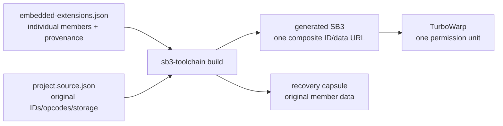

# 紙芝居DSL 4.0 設計レビュー草案

Copyright © 2026 Hiroya Kubo.

文書状態: 全体architectureの設計資料（表層構文はIssue #260の確定仕様を参照）

対象: DSL設計者、Scratch／TurboWarp実装者、教材設計者

関連Issue: [#199](https://github.com/kubohiroya/tmpose-kamishibai/issues/199)

現行実装: [`tmpose-kamishibai 3.2.3`](../../README.md#dsl-32の互換性)

機能拡張構成: [`app/embedded-extensions.json`](../../app/embedded-extensions.json)
調査基準日: 2026-08-05

この文書は、紙芝居DSL 4.0とその実行基盤の全体architectureをレビューするための資料です。
表層構文についてはIssue #260のレビューが完了したため、
[`dsl-4-surface.md`](dsl-4-surface.md)と
[`schema/dsl-4.schema.json`](../../schema/dsl-4.schema.json)を実装基準とします。

## 判断状態の読み方

各設計項目を次の状態で示します。

| 状態     | 意味                                                      |
| -------- | --------------------------------------------------------- |
| 現行事実 | 3.2.3または固定ツールチェインですでに実装・検証されている |
| 決定済み | これまでの設計議論で4.0でも採用する方向が合意されている   |
| 提案     | 本文書がレビュー対象として提示する具体案                  |
| 保留     | 先に依存する設計のレビューを終えるまで判断を進めない      |
| 未決     | 実装前に選択または追加検証が必要                          |

「決定済み」は、細部まで凍結したことを意味しません。後から重大な問題が分かった場合は、
根拠を記録した上で再検討します。

「現行事実」は4.0で無条件に維持する判断を意味しません。4.0で変更する場合は、現行契約、
変更理由、移行、ロールバックを明記します。

レビューでは、まず「2. 現時点の設計判断一覧」で前提を確認し、「3. DSL 4.0の表層構文」で
台本の読みやすさを評価してください。その後、「7」から「11」で実行基盤を確認し、最後に
「15. レビューが必要な未決事項」のチェック項目ごとに判断を記録する想定です。

## 0. 現行3.2ベースライン

Issue #199の初回着手後にDSL 3.2、埋め込み機能拡張、SB3ツールチェインが更新されました。
4.0案は次の既成事実を設計入力とし、3.1だけを基準にしません。

### 0.1 DSLと診断 `[現行事実]`

- 3.2.3は`kamishibai=3.1`と`kamishibai=3.2`を受理し、新規台本には3.2を推奨する
- 実行用の台本解析は引き続きScratch側が担当し、起動時固定・既定OFFの
  `featureDetailedScriptErrors`を有効にした場合は`kubohiroyakamishibairuntime`が副作用前の
  preflight、行・列付き`K32-*`診断、SVGエラー表示、安全停止を担当する
- 旧Text Assetは3.1／3.2で実行可能だがdeprecatedであり、3.2系列だけの移行互換とする
- 新規テキスト表示は、名前付きスタイルと`setText`を提供するSVG Textを使用する
- SVG Textは`./composition` APIを含むGit commit、成果物のSHA-256、API manifestを固定する

4.0はこの診断UXを維持しつつ、preflightとScratchパーサーの二段構成を、Source Mapを持つ
単一のJavaScriptパーサーへ置き換える提案です。

### 0.2 埋め込み機能拡張 `[現行事実]`

現行の正本は`app/embedded-extensions.json`内の個別エントリと、個別JavaScriptを参照する
`app/project.source.json`です。生成SB3だけが`extensionBundles`によって変換されます。

`tmposebundle`のmemberは次の4件です。

| member                        | source provider | 現行の役割                                 |
| ----------------------------- | --------------- | ------------------------------------------ |
| `kubohiroyaassetmanager`      | GitHub          | アセット登録、skin、音声、旧Text Asset互換 |
| `text`                        | GitHub          | Animated Textと3.2診断表示                 |
| `kubohiroyakamishibairuntime` | local           | preflight、診断、3.1／3.2移行制御          |
| `kubohiroyasvgtext`           | npm             | 3.2の名前付きSVG Text                      |

`sb3-toolchain`は生成時に次を行います。

- memberごとのIDとdata URLを一つのbundle IDとdata URLへ変換する
- block、monitor、menu、custom field、hat、extension storageをmember namespaceへ写す
- memberからの`runtime.startHats()`と`runtime.getOpcodeFunction()`をbundle opcodeへ変換する
- 個別sourceとprovenanceを展開ソースに残し、復元カプセルによるunbundleを可能にする
- 安全に分類できないmemberや未分類opcode参照を、推測で変換せずbuild errorにする

したがって4.0では、独自の合成系を先に新設せず、現行`extensionBundles`契約を第一候補とします。

### 0.3 source providerと更新契約 `[現行事実]`

- GitHub providerはrepository、ref、resolved commit、artifact、SHA-256を記録する
- npm providerはpackage、完全固定version、artifact、SHA-256を記録し、導入済みpackageから
  ネットワークなしで`status`／`sync`する
- 任意のAPI manifestはopcode、block type、argument、menu契約を記録し、更新前に互換性を比較する
- `status`、`sync`、`update`は個別member単位で行い、bundle生成と依存更新を混同しない
- TurboWarp block cleanupは既定OFFの明示オプションであり、DSL 4.0の構文、runtime、Bundle
  設計には含めない

### 0.4 3.2から維持・変更する境界

| 対象                      | 4.0での扱い                                                       |
| ------------------------- | ----------------------------------------------------------------- |
| 一行ずつ読める台本        | 維持する                                                          |
| 3.1／3.2台本の実行        | 3.2 runtimeで維持し、4.0 parserへ混在させない                     |
| K32診断の表示と安全停止   | UXを維持し、K4の複数診断とSource Mapへ拡張する                    |
| 旧Text Asset              | 3.2互換に残し、4.0のcore schemaには入れない案をレビューする       |
| SVG Text                  | 4.0の標準テキスト表示候補として維持する                           |
| 個別の機能拡張source      | provider、version／commit、integrityを正本として維持する          |
| `extensionBundles`        | 4.0 Compositeの第一候補として維持する                             |
| 新しい`./composition` API | block登録なしの直接合成契約が必要なcapabilityに限定して公開する   |
| block cleanup             | DSL設計外。必要なbuildでだけ既定OFFオプションを明示的に有効化する |
| 台本製作者の作業          | 標準テンプレートのblock graphを変更せず、台本の記述だけで完結する |

現行ベースラインの変更履歴と固定仕様は、次を参照します。

- [`tmpose-kamishibai` PR #246](https://github.com/kubohiroya/tmpose-kamishibai/pull/246):
  Animated Textを含む静的bundleとmember間動的opcode変換
- [`tmpose-kamishibai` PR #252](https://github.com/kubohiroya/tmpose-kamishibai/pull/252):
  DSL 3.2、SVG Text、npm source provider
- [`turbowarp-svg-text` PR #14](https://github.com/kubohiroya/turbowarp-svg-text/pull/14):
  SVG Textのblock登録なし`./composition` API
- [`sb3-toolchain` PR #31](https://github.com/kubohiroya/sb3-toolchain/pull/31):
  `getOpcodeFunction()`のmember間変換
- [`sb3-toolchain` PR #32](https://github.com/kubohiroya/sb3-toolchain/pull/32):
  DSL設計から分離する既定OFFのblock cleanup
- [`sb3-toolchain` PR #38](https://github.com/kubohiroya/sb3-toolchain/pull/38):
  完全固定npm sourceの`status`／`sync`／`update`
- [固定toolchainの静的bundle仕様](https://github.com/kubohiroya/sb3-toolchain/blob/b3f4b9aa3ed3ede363700be815fe522f6a47df0b/docs/ja/extension-bundles.md)
- [固定toolchainの展開source形式](https://github.com/kubohiroya/sb3-toolchain/blob/b3f4b9aa3ed3ede363700be815fe522f6a47df0b/docs/ja/source-format-v1.md)

## 1. 設計の目的

### 1.1 解決する問題

DSL 3.2の実行用パーサーはScratchブロックで実装され、JavaScriptの限定preflightがその前段で
診断します。処理内容が見えるため教育的で、独自コマンドを追加しやすい一方、構文解析、検証、
実行制御が多数のブロックと共有変数へ分散しています。そのため、次の問題が残っています。

- 構文解析処理が冗長で、区切り文字や引数数に関する不具合を混入させやすい
- エラーの発生行、列、参照元、参照先を一貫して報告しにくい
- 未定義アセットやシーン参照を実行前に網羅的に検証しにくい
- Scratch側と機能拡張側へパーサーを二重に持つと、仕様差が生じる
- パース結果が共有変数へ分散し、構造化データとして再利用しにくい
- reporterがJavaScriptオブジェクトを直接返せない

### 1.2 台本製作者のゼロブロック原則 `[決定済み]`

DSL 4.0の最優先の作者体験は、**通常の台本製作者がTurboWarpのブロックを追加、複製、接続、修正せず、
台本の記述と修正だけで紙芝居を完成できること**です。標準テンプレートを開いた後に台本だけを
差し替えた作品では、保存されるblock graphがテンプレートから変化してはなりません。

利用者の役割を次のように分けます。

| 役割                      | 通常行う作業                                                     | block組立て  |
| ------------------------- | ---------------------------------------------------------------- | ------------ |
| 台本製作者                | YAML台本、アセット、SVG Text styleを記述・修正する               | 必須0        |
| 作品カスタマイザー        | DSLだけでは表現しない作品固有actionをScratchで任意に追加する     | 任意         |
| テンプレート保守者        | 起動、停止、再試行、タイトル、Loading等の共通app shellを保守する | 固定済み     |
| capability／runtime開発者 | parser、Store、controller、標準actionをJavaScriptで実装する      | 作者へ非公開 |

「必須0」は、テンプレート内部に一つもブロックが存在しないという意味ではありません。テンプレート保守者が
検証済みの起動・UI blockをあらかじめ提供し、台本製作者がそれを組み直さないという意味です。台本の取得経路を
project variable、asset、builder source、専用editorのどれにする場合も、台本変更のためにblock入力欄を探して
書き換える操作を標準手順にしません。

標準core actionで表現できる作品については、Scratch Action Registry、Object Store、Iterator、JSONPathの
blockを一つも配置しなくても実行できなければなりません。複数作品で繰り返し必要になる表現がcustom
actionを要求する場合は、作者へblock組立てを求め続けず、core actionまたはDSL schemaへ昇格させるかを
レビューします。

現行`app/project.source.json`は合計1,811 block（Stage 1,359、Actor 241、その他211）です。4.0の定量目標は
次とします。作品固有custom actionの演出本体は別集計にします。

| 指標                               | 4.0目標                                      |
| ---------------------------------- | -------------------------------------------- |
| 台本製作者が追加する必須block      | 0                                            |
| 固定テンプレートのDSL接続block     | 30以下                                       |
| project全体                        | 500以下、目標350以下                         |
| Stage                              | 150以下                                      |
| Actor                              | 20以下                                       |
| DSL実行用`lmsTempVars2_*`          | 0                                            |
| DSL実行用Scratch list              | 0                                            |
| 標準core action用Scratch procedure | 0                                            |
| custom actionの定型overhead        | 1 handlerあたり8 block以下（演出本体を除く） |

### 1.3 維持する価値

DSL 4.0は、3.2の実装をJavaScriptへ移植するだけの変更にはしません。一方で、3.1／3.2の
次の長所は維持します。

- 初めて見た子供でも、上から順に読める
- 一つの演出が原則として一行で表現される
- 背景、登場人物、セリフ、待機などの意味が記号に埋もれない
- 短い台本を少ない記述量で作れる
- 希望する作品カスタマイザーはScratch上で独自アクションを追加し、DSLを拡張する教育活動を行える
- 任意custom actionでは、台本とScratchプログラムの対応関係を観察できる
- 名前付きスタイルを再利用するSVG Textにより、テキストの意味と見た目を分離できる

### 1.4 非目標

- YAMLの全機能を紙芝居DSLとして公開すること
- DSLから任意のJavaScriptを実行すること
- 3.1／3.2と4.0を同じパーサー内で自動判別して実行し続けること
- reporterから生のJavaScriptオブジェクトを返すこと
- Temporary Variables拡張へ依存すること
- 許可後に別の機能拡張コードを動的にダウンロードすること
- 通常の台本製作者へ、parser、状態機械、標準actionのScratch実装を学習・保守させること
- block組立てを台本記述と同等の必須作業として残すこと

## 2. 現時点の設計判断一覧

| ID   | 状態     | 判断                                                                     |
| ---- | -------- | ------------------------------------------------------------------------ |
| D-01 | 決定済み | DSL 4.0のパーサーはTurboWarp機能拡張側へ一本化する                       |
| D-02 | 決定済み | Scratchブロックによる3.1／3.2パーサーを4.0ランタイムには残さない         |
| D-03 | 決定済み | 3.2に近い簡潔な一行アクションを維持する                                  |
| D-04 | 決定済み | Scratch Action Registryにより、ScratchでDSLアクションを拡張可能にする    |
| D-05 | 決定済み | オブジェクトはopaque referenceを介してScratchへ渡す                      |
| D-06 | 決定済み | Object StoreはTemporary Variablesとは別実装・別名前空間にする            |
| D-07 | 決定済み | Object Store、Iterator、JSONPathは紙芝居固有にしない                     |
| D-08 | 決定済み | Kamishibai用成果物は静的に合成し、一つの拡張として登録する               |
| D-09 | 決定済み | 正式な拡張IDは`kubohiroyakamishibai4`とする                              |
| D-10 | 決定済み | 実行時に子拡張をロードするメタ拡張方式は採用しない                       |
| D-11 | 決定済み | StoryDocumentは不変データとし、sceneを記述順のordered arrayで保持する    |
| D-12 | 決定済み | Action IDは内容ハッシュではなく文書内の決定的なStoryPathとする           |
| D-13 | 決定済み | 正規化後も各nodeから台本位置へ戻れるSource Mapを保持する                 |
| D-14 | 決定済み | Generic Core、TurboWarp Adapter、Kamishibai Adapterの三層に分ける        |
| D-15 | 決定済み | story／scene／actionの意味と寿命はKamishibai Adapterだけが扱う           |
| D-16 | 決定済み | Generic Coreの標準かつ正本の保存実装には`MapBackend`を採用する           |
| D-17 | 決定済み | 上位層への依存とbuildをまたぐobject referenceの共有を禁止する            |
| D-18 | 決定済み | 再利用可能なcapabilityは独立GitHub projectとして開発・配布可能にする     |
| D-19 | 決定済み | 個別Standalone成果物を展開ソースの正本として維持する                     |
| D-20 | 決定済み | 4.0 Compositeの第一候補に`sb3-toolchain`の静的bundleを使用する           |
| D-21 | 決定済み | Kamishibai固有adapterは本projectに置き、汎用projectから逆依存しない      |
| D-22 | 決定済み | 外部capabilityのversion／commit、artifact、integrityをsourceに固定する   |
| D-23 | 決定済み | 既存の公開package、repository、Standalone extension IDを維持する         |
| D-24 | 決定済み | bundleは生成SB3だけを変換し、個別ID／opcode／storageを展開sourceに残す   |
| D-25 | 決定済み | member間`startHats`／`getOpcodeFunction`はbundle namespaceへ変換する     |
| D-26 | 決定済み | block cleanupはDSL設計外の既定OFF build optionとして扱う                 |
| D-27 | 決定済み | 通常の台本製作者は標準テンプレートのblock graphを変更せず台本だけを書く  |
| D-28 | 決定済み | parser、状態管理、controller、標準action handlerを機能拡張側へ置く       |
| D-29 | 決定済み | Scratch Action Registryは任意の作品固有拡張であり標準作品には要求しない  |
| D-30 | 決定済み | Object Store／Iterator等の汎用blockを標準作者経路へ露出させない          |
| D-31 | 決定済み | 標準Composite、Standalone汎用palette、developer debug配布を分離する      |
| D-32 | 決定済み | delivery、loading、memory retention、永続cacheの寿命を独立させる         |
| D-33 | 決定済み | poseModelの既定retentionをscene、mediaの既定をstoryとする                |
| D-34 | 決定済み | binary DBを台本単位で分離し、可読名と共通metadata catalogで管理する      |
| D-35 | 決定済み | selected next sceneだけを先読みし、遷移commit時に不要resourceを解放する  |
| D-36 | 決定済み | Storeはlease／RefValueをcountし、外部参照が残るclosureをatomicに拒否する |
| D-37 | 決定済み | cross-owner strong cycleを作成時拒否し、初版でweak／multi-freeを持たない |
| D-38 | 決定済み | Store handleはruntime-onlyの128-bit nonceによるopaque tokenとする        |
| D-39 | 決定済み | live reloadは参照を含まないplain valueだけを新realmへdeep copyする       |
| D-40 | 決定済み | JSONPath初版はname／index／wildcard／sliceのchild segment subsetとする   |
| D-41 | 決定済み | Scratch facadeはscalarとreferenceのquery reporterを分離する              |
| D-42 | 決定済み | Iterator終端後のnextはidempotentに`done`を返す                           |
| D-43 | 決定済み | ExceptionRefはAdapter固有の`@sdx1` tokenとしCore handleから分離する      |
| D-44 | 決定済み | custom handlerのprimary thread正常終了を暗黙completeとする               |
| D-45 | 決定済み | ActionContextはprimary thread単位としbroadcast／cloneへ暗黙伝播しない    |
| D-46 | 決定済み | custom actionのquiesce既定を`finish-only`とする                          |
| D-47 | 決定済み | reload planはaction cleanup後のQuiesceTokenから作る                      |
| D-48 | 決定済み | Esc再開でも位置以外のruntime stateと副作用を巻き戻さない                 |
| P-01 | 提案     | DSL 4.0の表層構文はYAML 1.2の制限付きサブセットを基礎とする              |
| P-02 | 提案     | パース成功後に不変な`StoryDocument`をObject Storeへ格納する              |
| P-03 | 提案     | 実行には型付きIteratorを優先し、JSONPathは汎用参照・拡張に使う           |
| P-04 | 提案     | 全文検証が成功するまで、アセット読込や紙芝居実行を開始しない             |
| P-05 | 提案     | 複数エラーを収集し、SVGエラー画面から発生位置と原因を確認可能にする      |
| P-07 | 提案     | 旧Text Assetを4.0 core schemaへ入れず、SVG Textを標準経路にする          |
| P-08 | 提案     | 4.0で更新する全managed memberにAPI manifestを要求する                    |
| P-09 | 提案     | `./composition`は現行bundleで不足が確認されたcapabilityだけに追加する    |
| P-10 | 提案     | project全体350 block以下を目標、500 block以下を受け入れ上限とする        |

## 3. DSL 4.0の表層構文

> **この章の3.1〜3.15は初期案を残した設計履歴であり、実装仕様ではありません。**
> `cover`、複数引数action、pose recognition、pose model、asset loadingなどはIssue #260で
> 見直されました。実装と新しいレビューでは
> [`紙芝居DSL 4.0 表層仕様`](dsl-4-surface.md)および
> [`JSON Schema`](../../schema/dsl-4.schema.json)を参照してください。

### 3.1 基本方針 `[提案]`

DSL 4.0はYAML 1.2を基礎とします。ただし、実装が受け付けるのは紙芝居用スキーマで
定義した構造だけです。YAMLタグによるオブジェクト生成や任意型の復元は許可しません。

この表層構文を、通常の台本製作者にとって唯一の必須programming surfaceとします。標準的な背景、
登場人物、台詞、音声、待機、分岐、入力、ポーズ認識、遷移、SVG Textは台本だけで記述できなければ
なりません。これらを成立させるためにTurboWarp blockの追加を要求する仕様はcore actionの不足として
扱い、block操作手順を利用者文書へ追加することで解決しません。

バージョン宣言は次の形を提案します。

```yaml
kamishibai: '4.0'
```

文字列として扱うことで、`4.0`が数値`4`へ正規化されることを避けます。

### 3.2 最小例 `[提案]`

```yaml
kamishibai: '4.0'

assets:
  Beach: backdrop
  Hero: costume
  OpeningSound: sound

actors:
  Hero: Hero

cover: [Beach, OpeningSound]

scenes:
  opening:
    - stage: Beach
    - Hero.show: [Hero, 0, -60, 30]
    - Hero.say: ['こんにちは！', 2]
    - wait: 1
```

3.2の`action=`とコロン区切りを、YAMLの「キーと値」へ置き換えています。一つの
アクションを一つのリスト項目として書くため、実行順は上から下へ読み取れます。

### 3.3 3.2との見た目の比較

3.2:

```text
kamishibai=3.2
asset=Beach,backdrop
asset=Hero,costume
asset=OpeningSound,sound
actor=Hero,Hero
cover=Beach,OpeningSound
---
sceneLabel=opening
action=stage:Beach
action=Hero:show:Hero:0,-60,30
action=Hero:say:こんにちは！:2
action=wait:1
```

4.0案:

```yaml
kamishibai: '4.0'
assets: {Beach: backdrop, Hero: costume, OpeningSound: sound}
actors: {Hero: Hero}
cover: [Beach, OpeningSound]
scenes:
  opening:
    - stage: Beach
    - Hero.show: [Hero, 0, -60, 30]
    - Hero.say: ['こんにちは！', 2]
    - wait: 1
```

短い定義はYAMLのinline表記を使えます。教材では読みやすい複数行表記を基本とし、
記述量を減らしたい作者はinline表記を選べるようにします。

### 3.4 アクションの共通形式 `[提案]`

一つのアクションは、キーを一つだけ持つYAML mappingとします。

```yaml
- アクション名: 引数
```

グローバルアクション:

```yaml
- stage: Beach
- wait: 1.5
- bgm: GuitarChords
- sound: Gong
- transition: fadeOut
- branch: chooseRoute
```

アクターアクション:

```yaml
- Hero.show: [HeroHappy, 0, -60, 30]
- Hero.moveTo: [40, -57, 1.5]
- Hero.say: ['冒険に出発だ！', 2]
- Hero.setSkin: HeroSurprised
```

アクターアクションのキーは、最初の`.`より前をアクター名、後ろをコマンド名として
解釈します。アクター名に`.`を許可するか、長形式で回避可能にするかは未決です。

### 3.5 位置引数と名前付き引数 `[提案]`

よく使うアクションは3.2に近い位置引数で短く書けます。

```yaml
- Hero.show: [HeroHappy, 0, -60, 30]
```

同じアクションを名前付き引数でも書ける案を併記します。

```yaml
- Hero.show:
    skin: HeroHappy
    position: [0, -60]
    scale: 30
```

パーサーは両者を同じ内部形式へ正規化します。位置引数は短く、名前付き引数は意味を
確認しやすいという長所があります。一方、複数表記を許すと仕様とテストが増えるため、
4.0初版で両方を採用するかはレビューが必要です。

### 3.6 シーンの短形式と長形式 `[提案]`

シーン固有の設定がない場合は、アクション列を直接書きます。

```yaml
scenes:
  opening:
    - stage: Beach
    - wait: 1
```

ポーズモデルなどの設定がある場合は、長形式を使います。

```yaml
scenes:
  rescue:
    poseModel: https://example.com/pose-model/
    actions:
      - stage: Ocean
      - Hero.pose: [HeroHelp, help, SquishPop]
```

どちらも内部では同じ`SceneNode`へ正規化します。

### 3.7 アセット `[提案]`

3.2の短縮アドレスを維持します。

```yaml
assets:
  Beach: backdrop
  Hero: costume
  HeroHappy: costume:Hero
  OpeningSound: sound
  RemoteImage: https://example.com/images/remote.png
```

複雑な参照には名前付き形式を使用できます。

```yaml
assets:
  HeroHappy:
    kind: costume
    target: Hero
    name: Hero-happy
    loading: lazy
    retention: story
  救助Pose:
    kind: poseModel
    file: rescue-pose
    loading: lazy
    retention: scene
```

パーサーは短縮アドレスを文字列のまま保持せず、次のような型付きアドレスへ変換します。

```json
{
  "kind": "costume",
  "target": "Hero",
  "name": "Hero-happy"
}
```

これにより、`costume:`の分割や対象検索を実行時に繰り返しません。

### 3.8 SVG Text `[提案]`

4.0の標準テキスト経路には、3.2で導入した名前付きSVG Textを使用します。旧Text Assetの
`asset=...,text`、`text=`、`textStyle=`は4.0のcore schemaへ入れず、3.2 runtimeとconverterの
互換責務に残す案です。

```yaml
textStyles:
  title:
    background: '#112233'
    color: '#ffffff'
    font: Noto Sans JP
    size: 150
    align: center
    direction: up

scenes:
  opening:
    - Hero.setText: ['タイトル\nサブタイトル', title]
```

3.2の`svgTextStyle=STYLE:BACKGROUND:TEXT_COLOR:FONT:SIZE:ALIGN:DIRECTION`を名前付きmappingへ
正規化します。`size: 100`は480×360ステージの標準14px相当、`direction`は吹き出しにだけ適用、
文字列中の`\n`は改行という3.2契約を維持します。アニメーションを4.0初版へ含めるかは未決です。

### 3.9 アクター、表紙、初期変数 `[提案]`

```yaml
actors:
  Hero: Hero
  Princess: Princess

cover: [Beach, OpeningSound]

variables:
  startScene: opening
  takeSeaRoute: true
  score: 1
```

YAMLのBoolean、数値、文字列を保持します。ただし式評価側へ渡す型とScratch変数へ
投影する型の規則は別途定義します。

### 3.10 Loadingとポーズ認識音 `[提案]`

```yaml
loading:
  backdrop: LoadingBackground
  costumes: [Loading1, Loading2, Loading3]

poseRecognition:
  idleSound: ClockTicking
  chargeSound: Success
  sequence:
    confidenceThreshold: 0.5
    fullConfidenceHoldSeconds: 1
    idleChargePerSecond: 0
  selection:
    accumulationPerSecond: 1
    decayPerSecond: 0.9
    scoreThreshold: 0
  feedback:
    mode: scratchMirror
  navigation:
    allowSkip: false
  preview:
    mirroring: mirrored
```

3.2の`setLoadingBackdrop`、`setLoadingCostume`、`setPoseRecognitionSound`を、関連項目ごとの
mappingへまとめます。sequenceとselectionは排他でActor sequenceを優先し、selectionはaction
実行ごとに蓄積scoreをresetします。重複するselectionは直近の1回だけを有効にします。

`feedback.mode`は`scratchMirror | scratchBinding | presenter`の3値に限定し、省略時は
`scratchMirror`です。`navigation.allowSkip`は独立したbooleanで、省略時は`false`です。semantic pose
state eventはrenderer非依存とし、`phase`、`target`、`pose`、`stepIndex`、0〜1の`confidence`／`progress`
だけを通知します。Scratch／presenter adapterとnavigation bypassはこのpure event契約のconsumerとして
分離し、起動時固定・既定OFFの`dsl4PoseFeedbackModes`がOFFなら登録しません。
Standardの`presenter` consumerはScratch variableやmonitorを使わず、actor／pose／step、認識度、チャージを
app shell所有のDOMへ表示します。認識度とチャージは別々のnative `progress`と数値で示し、accessible nameと
polite live regionを持たせ、色だけに依存しません。`waiting`／`charging`で表示し、`completed`／`cancelled`で
値を0へ戻して隠します。scene移動、skip、abort、stop、live reload、disposeの最終`cancelled`も同じ経路で
処理し、disposeではDOMを解放します。追加の開発者observerはpresenterと独立して例外隔離します。
visual値は各tickで更新しますが、live regionはphase／actor／pose／stepの変化だけを通知します。
`createDsl4StandardAppShell`がWeb player、通常editor、Packager、development previewのsurface名を同じ
compositionへ束ね、`dsl4AppShell`が有効なsessionだけruntime hostとpresenter containerを所有します。
containerはpresenter modeで初めて遅延生成し、surface固有の暗黙modeを追加しません。flag OFFまたは別modeでは
presenter optionのDOM設定を検査しません。
`allowSkip: false`のrefusalは実際の`waitForPose` pending期間だけに適用し、拒否したkeymap入力をDOMで
消費しません。policy有効sessionの受理するkeymap commandはすべて同じ同期dispatch境界を通し、historyと
`navigation.nextAction`の到着順を保ちます。`setSkin`やstep sound中は従来のnavigation契約を維持します。

`preview.mirroring`はcamera preview canvasのstory既定で、`mirrored | unmirrored`だけを受け付けます。
省略時は`mirrored`です。長形式sceneは`posePreview.mirroring`でそのsceneだけを上書きでき、scene入場ごとに
effective値を再適用します。上書きのないsceneではstory既定へ戻し、前sceneの値を引き継ぎません。
`dsl4PosePreviewMirroring`は起動時固定・既定OFFとし、OFFではTMPoseの新methodを検査・呼出しません。
ONでは`@kubohiroya/turbowarp-tmpose/composition`の
`setPreviewMirroring('mirrored' | 'unmirrored')`を直接使い、method欠落時はstartupでfail closedにします。
preview transformはrecognition入力の`flipHorizontal`、confidence、sequence／selection判定から分離します。
Web player、通常editor、Packager、development previewは同じconsumerを使い、surface固有の暗黙値を
追加しません。DSL 3.1／3.2とStandalone block／paletteは変更対象外です。

Scratch consumerはplatform composition境界に置き、coreにScratch variable IDやVM targetを持ち込みません。
`scratchBinding`の入力はrenderer非依存な0〜1の`confidence`／`progress`sampleとして、各計算tickの
開始時に最大1回取り込みます。invalidなScratch snapshotは両fieldともfail-closedで無視し、
センサー値、sequence積分、soundを変更しません。同一tick内の複数writeはScratch runtimeの実行順に従い、
tick境界の最終pairを決定的にsampleします。adapter startupでは専用の2つのStage variableを0へ戻して
monitorを隠し、active stateでだけ表示します。terminal eventは非同期sound cleanupより先にbindingを
無効化してmonitorを隠し、Scratchの一時表示値を直ちに0へresetします。

`preview.controls`はapp shell所有の任意camera UIです。`mirroring`と`cameraMenu`は8 anchor、個別opacity、
eagerな`kind: image` assetを指定します。同一anchorはこの順序でgroup化し、preview矩形へ追従します。
反転iconは操作後のtarget stateを示し、composition成功時だけ更新します。camera menuはopenごとに端末を
再列挙し、opaque device IDをsession外へ保存しません。asset byte、Object URL、DOM listener/nodeは同じ
story owner scopeで解放します。自然終了またはfail時はrendererとlistenerを停止する一方、履歴からの
巻き戻しに備えてDOMとasset・Object URL leaseをsession内に保持します。`navigation.reposition`または
`runtime.resume`で同じrendererを再開し、明示的なstory stopまたはhost disposeで初めて所有resourceを解放します。
起動時固定・既定OFFの`dsl4CameraPreviewControls`がOFFならcontrol専用assetを
startup準備から除外し、TMPose camera APIもDOM rendererも検査しません。これはStandard productionの固定UI
であり、台本製作者の必須block 0、palette block 0を維持します。`mirroring` controlがあるsessionは#387の
story／scene effective mirroringを同じcompositionへ適用し、外部の反転変更もtarget-state iconへ同期します。

### 3.11 分岐 `[提案]`

3.2の条件リストと遷移先リストを別々に並べる形式を廃止し、条件と遷移先を一組として
記述します。

```yaml
branches:
  chooseRoute:
    - if: 'score == 1'
      goto: ocean
    - if: takeSeaRoute
      goto: seaRoute
    - else: home
```

シーンからは次のように呼び出します。

```yaml
- branch: chooseRoute
```

`if`の値は`turbowarp-runtime-expression`互換の式として構文解析します。式の具体的な
言語仕様を4.0で固定するか、評価器を交換可能にするかは未決です。

### 3.12 入力による遷移 `[提案]`

```yaml
- keyInputToChangeScene:
    ArrowLeft: leftRoute
    ArrowRight: rightRoute

- touchInputToChangeScene:
    LeftDoor: leftRoute
    RightDoor: rightRoute
```

入力と遷移先の個数不一致が構造上発生しない形にします。

### 3.13 ポーズ認識 `[提案]`

単一ポーズ:

```yaml
- Hero.pose: [HeroJump, jump, JumpSound]
```

複数ポーズ:

```yaml
- Hero.pose:
    - [HeroLeft, left, StepSound]
    - [HeroRight, right, StepSound]
```

3.2のスキン名リスト、ポーズ名リスト、効果音リストという三つの並行配列を、
一ポーズごとの組へ変換します。これによりリスト長不一致を構造上防ぎます。

### 3.14 YAML利用範囲と安全制限 `[提案]`

- YAML 1.2 core schemaを基準とする
- カスタムタグを禁止する
- 任意クラスや関数の復元を禁止する
- alias数、nesting深度、node数、文字列長、ファイルサイズに上限を設ける
- `__proto__`、`prototype`、`constructor`など、オブジェクト汚染につながるキーを拒否する
- duplicate keyをエラーにする
- merge keyを禁止する
- 日時型への暗黙変換を行わない
- source locationを失う単純な`parse()`結果だけに依存せず、CSTまたは同等の位置情報を保持する

上限値は実装前ベンチマーク後に決めます。

### 3.15 総合例 `[提案]`

次は、アセット、SVG Text、アクター、シーン、アクション、分岐、入力、ポーズ認識を一つに
まとめたレビュー用例です。個々の短形式は3.2に対応しますが、YAML schema自体は未実装です。

```yaml
kamishibai: '4.0'

assets:
  Beach: backdrop
  Ocean: backdrop
  HeroIdle: costume:Hero
  HeroJump: costume:Hero
  ClockTicking: sound
  Success: sound

textStyles:
  title:
    background: '#112233'
    color: '#ffffff'
    font: Noto Sans JP
    size: 150
    align: center
    direction: up

actors:
  Hero: HeroIdle
  Caption: HeroIdle

cover: [Beach, Success]

variables:
  score: 1

poseRecognition:
  idleSound: ClockTicking
  chargeSound: Success
  sequence:
    confidenceThreshold: 0.5
    fullConfidenceHoldSeconds: 1
    idleChargePerSecond: 0
  selection:
    accumulationPerSecond: 1
    decayPerSecond: 0.9
    scoreThreshold: 0

branches:
  chooseRoute:
    - if: 'score == 1'
      goto: rescue
    - else: ending

scenes:
  opening:
    - stage: Beach
    - Hero.show: [HeroIdle, 0, -60, 30]
    - Caption.setText: ['海へ出発！', title]
    - Hero.say: ['助けに行こう', 2]
    - keyInputToChangeScene:
        ArrowRight: rescue
    - branch: chooseRoute

  rescue:
    poseModel: https://example.com/pose-model/
    actions:
      - stage: Ocean
      - Hero.pose: [HeroJump, jump, Success]
      - wait: 1
      - goto: ending

  ending:
    - Caption.setText: ['おしまい', title]
```

## 4. パーサーと検証

### 4.1 単一パーサー `[決定済み]`

現行3.2は`kubohiroyakamishibairuntime`のpreflightとScratch実行用パーサーを直列化し、
行・列付き`K32-*`診断を安全に追加しています。この境界は3.2互換パッチとして維持しますが、
4.0へ二つの構文実装を持ち込みません。

DSL 4.0を解釈する正本は`kubohiroyakamishibai4`機能拡張内のパーサーだけです。
Scratch側に同じ構文規則を再実装しません。

標準テンプレートと機能拡張は、台本製作者の操作なしに次を直列実行します。

- templateが管理するsource channelから台本テキストを取得する
- パース・検証を開始し、成功したStoryDocumentをruntime内部で受け渡す
- アセット準備と紙芝居実行を開始する
- 終了、停止、再試行、タイトル復帰でrealmとresourceを解放する
- エラーをSVGで表示し、Source Mapから台本の修正位置を示す

Scratch側へ残すのは、テンプレート保守者が管理する固定app shellと、作品カスタマイザーが明示的に
選んだcustom actionだけです。台本製作者にStoryDocument referenceを変数へ格納させたり、parse、
validate、startを別々のblockとして接続させたりしません。

### 4.2 処理段階 `[提案]`

1. 入力をUTF-8テキストとして受け取る
2. YAML構文を解析し、全nodeのsource rangeを保持する
3. `kamishibai`バージョンとトップレベル構造を検証する
4. assets、actors、scenes、branches、variablesのsymbol tableを作る
5. アセットアドレスを型付き構造へ正規化する
6. すべての参照を解決する
7. core action schemaとScratch Action Registryによりアクションを検証する
8. Runtime Expressionの式を構文解析する
9. 不変な`StoryDocument`を生成する
10. エラーが0件の場合だけObject Storeへ格納し、root referenceを返す

検証中にアセットをロードしたり、ステージを変更したり、アクターcloneを生成したりしません。

### 4.3 検証する参照 `[提案]`

- アセット定義の短縮アドレスが実在するcostume、backdrop、soundへ解決できるか
- actorの初期skinが定義済み画像アセットか
- `stage`が定義済みbackdropアセットを参照しているか
- `show`、`setSkin`、`pose`、`loop`、`sequence`が定義済みアセットを参照しているか
- `bgm`、`sound`、ポーズ認識音が定義済みsoundアセットか
- `setText`が定義済みSVG Text styleを参照しているか
- `branch`が定義済みbranchを参照しているか
- branch、key、touch、gotoが定義済みsceneを参照しているか
- action commandがcore actionまたはScratch Action Registryに登録済みか
- 式が評価前に構文解析可能か

### 4.4 エラー収集方針 `[提案]`

最初の一件で解析を終了せず、安全に継続可能な範囲で複数エラーを収集します。ただし、
YAML構造を回復できない構文エラーでは、その地点で意味検証を中止します。

過大な入力により画面が埋まらないよう、表示・保持するエラー数には上限を設けます。
上限到達時は`K4-TOO-MANY-ERRORS`を追加します。

### 4.5 3.2診断との互換境界 `[決定済み]`

- `K32-*`は3.1／3.2入力用の互換診断として維持する
- `K4-*`はYAML CST、schema、Source Mapを利用する4.0専用診断とする
- `K32-*`と`K4-*`のcodeを同じ意味に見せかけて再利用しない
- 画面の日本語／英語、source excerpt、SVG escape、安全停止、再試行というUXは共有する
- 3.2台本を4.0 parserへ渡した場合はconverterを暗黙実行せず、version不一致を返す

### 4.6 標準作者フローとblock graph不変条件 `[決定済み]`

標準的な新規作品の作成手順は次とします。

1. 検証済みのDSL 4.0標準テンプレートを開く
2. 台本sourceと参照するアセットを編集する
3. previewを実行する
4. `K4-*`診断が示す台本位置を修正する
5. 同じテンプレートからWeb版またはPackager成果物を生成する

この手順にTurboWarpのコード領域を開く操作、blockの複製、接続、broadcast名や変数名の入力を含めません。
最小台本、全core action台本、分岐・入力・ポーズ認識を含む台本のいずれも、台本sourceを変更するだけで
実行できることをfixtureで検証します。

台本Aから台本Bへ差し替えたとき、標準テンプレートの`targets[].blocks`はbyte-for-byteで同一であることを
原則とします。台本保存方式によりblock以外のvariable value、asset、manifestが変化することは許容します。
source channelの具体形式は実装前に決めますが、このblock graph不変条件を破る方式は採用しません。

## 5. 診断情報とSVGエラー画面

3.2.3は`featureDetailedScriptErrors`が有効な場合、最初のfatal diagnosticをJSONとして保持し、
行・列・該当行をXML escapeしたSVGへ描画して、安全停止と再試行を行います。4.0ではこの表示契約を
置き換えるのではなく、
複数診断、関連位置、正規化nodeへのpathを追加します。

### 5.1 診断モデル `[提案]`

```json
{
  "code": "K4-ASSET-UNDEFINED",
  "severity": "error",
  "message": "アセット 'HeroMissing' は定義されていません。",
  "path": "$.scenes.opening.actions[2].skin",
  "source": {
    "uri": "story.yaml",
    "line": 18,
    "column": 21,
    "endLine": 18,
    "endColumn": 32,
    "excerpt": "    - Hero.setSkin: HeroMissing"
  },
  "related": [],
  "hint": "assetsに追加するか、定義済みのアセット名へ変更してください。"
}
```

`path`は正規化前のYAML構造を指す論理パスです。JSONPathと完全に同じ構文へするかは
未決ですが、エラー表示とテストで安定して参照できる表記にします。

### 5.2 必須エラー分類 `[提案]`

| code                       | 例                                                  |
| -------------------------- | --------------------------------------------------- |
| `K4-VERSION-UNSUPPORTED`   | `kamishibai`が未対応                                |
| `K4-YAML-SYNTAX`           | YAMLの字下げ、括弧、引用符が不正                    |
| `K4-SCHEMA-INVALID`        | 必須項目不足、型違い、未知のトップレベル項目        |
| `K4-COMMAND-UNSUPPORTED`   | coreにもAction Registryにもないコマンド             |
| `K4-ASSET-ADDRESS-MISSING` | `costume:`などの参照先がSB3内に見つからない         |
| `K4-ASSET-UNDEFINED`       | `setSkin`や`pose`が未定義アセットを参照             |
| `K4-SCENE-UNDEFINED`       | 未定義シーンへの遷移                                |
| `K4-BRANCH-UNDEFINED`      | 未定義branchの実行                                  |
| `K4-EXPRESSION-SYNTAX`     | Runtime Expressionの式に構文エラー                  |
| `K4-REGISTRY-MISSING`      | Scratchカスタムアクションのhandlerが見つからない    |
| `K4-RESOURCE-LIMIT`        | サイズ、深度、node数、alias数などの安全上限を超えた |

### 5.3 画面表示と停止 `[提案]`

1. パーサーが`DiagnosticList`参照を返す
2. Kamishibai controllerが通常の開始処理へ進まない
3. 進行中のLoading、入力待ち、ポーズ認識、紙芝居用threadを停止する
4. 一時的に作成したscene/action scopeを解放する
5. 診断情報をXML escapeしてSVGへ描画する
6. 専用Error表示targetまたはStageへSVG costumeとして表示する
7. エラー番号、ファイル名、行・列、抜粋、説明、修正候補を表示する
8. 複数エラーの前後移動、再読み込み、タイトル復帰を提供する

SVG生成部は入力文字列をmarkupとして連結せず、必ずescapeします。長すぎる行は表示幅に
合わせて折り返し、完全な診断情報はObject Store内に保持します。

パーサーは副作用を起こさないため、検証失敗時は「途中まで実行された紙芝居」を巻き戻す
必要がありません。実行時エラーについては、現在のscene/action scopeを終了して同じ
エラー画面へ遷移します。

## 6. パース後の情報構造

### 6.1 StoryDocument `[決定済み]`

```json
{
  "kind": "StoryDocument",
  "version": "4.0",
  "metadata": {},
  "assets": {},
  "actors": {},
  "variables": {},
  "branches": {},
  "scenes": [
    {
      "id": "opening",
      "poseModel": null,
      "actions": []
    }
  ],
  "sourceMap": {}
}
```

StoryDocumentはパース完了後に変更しない不変データとします。実行中の現在scene、iterator
位置、actor状態、入力待ちなどは別の`ExecutionState`へ保持します。`scenes`は台本の記述順を
保持するordered arrayとし、各sceneは名前に由来する一意なscene IDを持ちます。scene IDから
配列位置を引くindexは派生データであり、StoryDocument本体とは分離します。

### 6.2 正規化ActionNode `[決定済み]`

短形式と長形式は、次のような同一構造へ変換します。

```json
{
  "kind": "Action",
  "id": "/scenes/opening/actions/2",
  "target": "Hero",
  "command": "show",
  "args": {
    "skin": "HeroHappy",
    "position": [0, -60],
    "scale": 30
  },
  "sourceRange": {
    "line": 12,
    "column": 5,
    "endLine": 12,
    "endColumn": 42
  }
}
```

actionの`id`は内容ハッシュではなく、正規化StoryDocument内の決定的な`StoryPath`とします。
sceneは配列位置ではなくscene IDで識別し、actionはscene内の0始まりの記述順で識別します。

```text
/scenes/<scene-id>/actions/<zero-based-index>
```

引数などの子nodeは、同じpathへfield名を追加します。

```text
/scenes/opening/actions/2/args/skin
```

内容や空白だけを変更してもpathは変わりません。scene名の変更、actionの移動、前方へのaction
挿入ではpathが変わります。このIDは同じ文書構造内の診断・実行トレース・Source Map対応を
目的とし、編集をまたいで永続する外部IDとはみなしません。

### 6.3 Source Map `[決定済み]`

正規化によりYAML上の形が失われても、StoryDocument、scene、action、引数、参照ごとに
元の範囲へ戻れるsource mapを保持します。実行時に未定義状態や式評価エラーが発生した場合も、
元の台本位置を表示します。Source Mapのkeyには6.2のStoryPathを使用します。

## 7. 汎用Object StoreとKamishibai固有層の境界

### 7.1 レイヤー構成 `[決定済み]`

Object Storeを汎用と呼ぶため、紙芝居の概念をObject Store coreへ持ち込みません。設計を
次の三層へ分離し、依存方向を下向きに限定します。

```text
Kamishibai Adapter
  └─ StoryDocument、StoryPath、story／scene／action lifecycle、K4診断
       ↓
TurboWarp Adapter
  └─ Scratch block facade、scalar変換、runtime変数projection、thread連携
       ↓
Generic Object Store Core
  └─ realm、opaque reference、entry、親子scope、new／get／free
```

| 層                        | 知ってよいもの                                      | 知ってはならないもの                                   |
| ------------------------- | --------------------------------------------------- | ------------------------------------------------------ |
| Generic Object Store Core | JavaScript value、type tag、realm、scope、reference | Scratch、TurboWarp、StoryDocument、scene、action       |
| TurboWarp Adapter         | Scratch scalar、block、VM adapter、runtime variable | 紙芝居DSL、StoryDocument schema、Kamishibaiの状態機械  |
| Kamishibai Adapter        | StoryDocument、scene、action、診断、実行controller  | Object Store backendの私有`Map`やruntime変数の内部配置 |

Generic CoreはTurboWarpなしで単体テストでき、Kamishibai AdapterはGeneric Coreの公開interface
だけを利用します。

### 7.2 Generic Object Store Coreの目的 `[決定済み]`

Scratch reporterは構造化オブジェクトを公開値として扱うことを前提としていません。
そこで、Generic Coreが構造化valueを保持し、呼び出し側へは文字列のopaque referenceだけを
返します。Generic Core自身は、このreferenceがScratch reporterを通過することを知りません。

参照文字列はruntime-onlyのopaque tokenとします。

```text
@os1.<realmNonce>.<handleNonce>
```

二つのnonceはそれぞれ128 bit以上の暗号学的乱数とし、kind、slot、generationを公開値へ含めません。
利用側は文字列を分解せず、Generic Coreまたはadapterの公開APIへそのまま渡します。

### 7.3 Generic Coreの参照と解放 `[決定済み #259]`

参照モデル、opaque handle、Result、atomic transaction、cycle、property test、live reload境界の正本は
[`DSL 4.0 Generic Object Store参照モデル`](dsl-4-object-store.md)とします。以下は判断経緯と要約であり、
矛盾する場合は専用文書を優先します。

#### 7.3.1 参照カウントとrealm／generationの役割

参照カウントを採用します。ただし、realm／generationを参照カウントで置き換えるのではなく、
異なる失敗を検出する仕組みとして併用します。

| 機構             | 防ぐ問題                                                              |
| ---------------- | --------------------------------------------------------------------- |
| reference count  | 生きている管理対象参照があるobjectを解放すること                      |
| realm            | 別のStoreまたは台本再読込前のStoreのreferenceを受け入れること         |
| slot＋generation | 解放後にslotが再利用されたとき、古いreferenceを新objectと誤認すること |

参照カウントが0であっても、別realmのreferenceや解放済みhandleを正しいものとは判断できません。
逆にrealmとgenerationが正しくても、生きている参照先を`free`してよいことにはなりません。

#### 7.3.2 handleの種類

Generic Coreのopaque handleを、少なくとも次の三種類に分けます。符号化された文字列を利用側が
分解することは禁止し、種類の判定もCoreのAPIを介します。

| 種類             | 作成契機                               | 参照先のcount | 解放操作                       |
| ---------------- | -------------------------------------- | ------------- | ------------------------------ |
| `OwnerRef`       | `newEntry`                             | 増やさない    | `free`で所有する構造を解放する |
| `ReferenceLease` | JSONPathのobject結果、明示的な参照作成 | 1増やす       | `releaseReference`で1減らす    |

`OwnerRef`は解放権限を示すhandleであり、自分自身への外部参照としては数えません。`ReferenceLease`は
参照先を生存させる管理単位です。同じlease文字列をScratchの複数の変数やlistへコピーしても、leaseが
増えたとはみなしません。それらは一つのleaseの別名です。いずれかの別名からreleaseすれば、ほかの
別名も同時に無効になります。独立した寿命が必要なら、Core APIで新しいleaseを明示的に作ります。

Store内のobjectから別nodeを指す場合は、単なる文字列ではなく`RefValue`という管理対象edgeとして
保持します。`RefValue`の作成で参照先のcountを1増やし、置換または削除で1減らします。一方、通常の
object propertyやarray elementによる構造的な親子関係は所有関係であり、`RefValue`として数えません。

`ExceptionRef`はCore handleではない。TurboWarp AdapterがCoreの失敗をScratch scalarへ投影する場合だけ
作り、Coreのhandle tableと参照countへ登録しない。形式と寿命は8章の専用仕様で定義する。

#### 7.3.3 JSONPath結果の扱い

- pure libraryでscalarを選んだ場合はscalar値をcopyして返し、参照カウントを変更しない
- pure libraryでobjectまたはarrayを一件選んだ場合は`ReferenceLease`を作り、選択nodeのcountを1増やす
- 複数nodeのquery結果は、選択した構造化nodeごとにleaseを所有するcollection entryとする
- collectionを解放すると、collectionが所有する全leaseをreleaseする
- Scratch facadeではscalar／referenceを混在させず、型別query reporterを使う
- queryが0件、複数件、型不一致になった場合のreporter表現はTurboWarp Adapterで定義する

JSONPath文字列そのものを参照として数えるのではありません。JSONPathの評価によって作られた
管理対象edgeまたはleaseを数えます。

#### 7.3.4 安全な`free`

`free(OwnerRef)`は、次の手順を一つのtransactionとして実行します。

1. realm、slot、generation、handle種別、所有権を検証する
2. 対象entryと、その構造的な子孫からなる解放closureを求める
3. closure外からclosure内へ入る`ReferenceLease`と`RefValue`を数える
4. 一つでも残っていれば、何も変更せず`STORE-OBJECT-IN-USE`で失敗する
5. closure内からclosure外へ出る`RefValue`と、closureが所有するleaseをreleaseする
6. closureと`OwnerRef`を削除し、再利用される各slotのgenerationを進める

「下位の構造化objectの参照カウントがすべて0」を、各nodeの生のcountが0という意味にはしません。
closure内部だけで完結する参照は、closureと同時に消えるためです。内部参照まで`free`を拒否する条件に
すると、自己参照を含むobjectや、親子間に参照を持つ一つの所有構造を解放できなくなります。安全性の
判定に使うのは、解放後にも残る**closure外部からの流入参照数**です。

scope解放も同じ判定を使います。配下のいずれかへ外部参照が残る場合はscope全体の解放をatomicに
失敗させ、途中まで削除しません。

#### 7.3.5 失敗の表現と不変条件

Generic Coreの公開操作は概念上`Result<Value, StoreException>`を返します。TurboWarp Adapterは
標準Kamishibai Runtimeでは失敗を`K4-*`診断へ変換してcontrollerへ返します。Standalone／上級利用向け
block facadeを公開する場合だけ、Scratch reporterで運べる`ExceptionRef`または同等のscalar値へ変換し、
Scratch側が`<例外か?>`に相当するpredicateで分岐できるようにします。JavaScript例外をScratchとの境界の
外へ投げたままにしません。ExceptionRefのopcode、predicate、diagnostic reporterは
[`Iterator・JSONPath・TurboWarp Adapter API`](dsl-4-iterator-jsonpath.md)で定義します。

最低限、次の汎用error codeを区別します。

| code                        | 意味                                         |
| --------------------------- | -------------------------------------------- |
| `STORE-OBJECT-IN-USE`       | 解放closureへ外部から参照が残っている        |
| `STORE-REFERENCE-RELEASED`  | release済みleaseを使用または再releaseした    |
| `STORE-REFERENCE-STALE`     | generationが一致しない                       |
| `STORE-REALM-MISMATCH`      | handleのrealmが現在のStoreと一致しない       |
| `STORE-REFERENCE-UNDERFLOW` | 内部不整合によりcountを0未満へ減らそうとした |

参照の作成・置換・削除とcount更新は、必ず同じtransactionで行います。各entryについて「countが生きた
管理対象流入edge数と一致する」という不変条件を検証できるデバッグAPIを用意します。

異なる`OwnerRef`のclosure同士にstrong `RefValue` cycleを作る操作は、作成時に
`STORE-STRONG-CYCLE`でatomicに拒否します。同一closure内のcycleはatomicに解放できます。初版では
weak referenceと任意OwnerRef集合のmulti-freeを提供しません。

#### 7.3.6 操作例

JSONPathで得た参照が`free`を止める例は次のとおりです。

| 順序 | 操作                                    | 対象nodeのcount | 結果                                      |
| ---- | --------------------------------------- | --------------- | ----------------------------------------- |
| 1    | `newEntry`でrootと子node `actor`を作る  | 0               | rootの`OwnerRef`を返す                    |
| 2    | `queryReference(root, "$.actor")`を実行 | 1               | `actor`へのlease `L1`を返す               |
| 3    | Scratch変数間で`L1`の文字列をcopyする   | 1               | 新しいleaseは作られない                   |
| 4    | rootの`free`を試みる                    | 1               | `STORE-OBJECT-IN-USE`、Storeは変更しない  |
| 5    | `L1`をreleaseする                       | 0               | `L1`を持つ全aliasが無効になる             |
| 6    | rootの`free`を再実行する                | 削除            | rootと`actor`を解放し、generationを進める |

別の所有closure Aの`RefValue`がclosure Bを指している場合、Bだけの`free`は失敗します。先にAを
解放またはedgeを削除すればBのcountが減り、Bを解放できます。AとBを含む共通scopeを一括解放する
場合は、そのedgeは解放closure内部の参照になるため、scope外からの参照がなければatomicに解放できます。

以上に加え、Generic Coreはobject、array、scalarなどのvalue、type tag、読み取り専用view、任意の
親子scopeを管理し、backendをinterfaceとして分離します。`StoryDocument`、`ActionView`、
`DiagnosticList`は組み込み型にせず、上位層がtype tagを登録します。

### 7.4 Generic scope `[決定済み #259]`

scope releaseは配下scope、entry、所有leaseを一つの解放closureとして扱い、外部流入参照が一件でも
あれば全体を変更せず失敗します。

Generic Coreのscopeは、紙芝居上の意味を持たない所有関係です。

```text
realm root scope
  ├─ child scope A
  │    └─ child scope B
  └─ child scope C
```

公開操作の概念は次です。

```text
createScope(parentScopeRef, label?) -> scopeRef
newEntry(value, typeTag, ownerScopeRef) -> ownerRef
createReference(ownerOrLeaseRef, path?) -> referenceLease
releaseReference(referenceLease)
releaseScope(scopeRef)
free(ownerRef)
```

`label`は診断用の文字列であり、lifecycleを決定しません。`action`、`scene`、`story`という文字列を
Generic Coreが特別扱いすることは禁止します。

### 7.5 TurboWarp Adapterの責務 `[決定済み #259／#261]`

Coreはimmutableな`StoreResult`を返し、TurboWarp Adapterだけが失敗をScratch scalarの
`ExceptionRef`へ変換できます。具体的なopcode、predicate、diagnostic reporterは
[`Iterator・JSONPath・TurboWarp Adapter API`](dsl-4-iterator-jsonpath.md)を正本とします。

- Standalone／上級利用向けに、opaque referenceをScratch stringとして受け渡すblock facadeを提供可能にする
- Scratchのnumber、string、BooleanとGeneric Coreのscalarを変換する
- `new`、`free`、参照作成・release、scope作成・解放の内部adapter APIを提供する
- `util.thread`などTurboWarp固有contextを必要なadapterへ渡す
- 必要な場合だけruntime変数への読み取り専用projectionを実装する
- Generic Store ErrorをScratchから扱えるscalar結果または診断参照へ変換する

この層には`StoryDocument`を検索するblockや`action scope`という名前のAPIを置きません。
汎用buildのruntime変数名へprefixが必要なら、例えば`@sd1/`のようにbuild manifestから注入し、
Generic Coreへ固定しません。

Kamishibai標準テンプレートでは、Kamishibai Runtimeがこのadapter APIをJavaScriptから直接利用します。
台本製作者へ`new`、`free`、scope、lease、iteratorのblockを表示または配置させません。汎用Structured Data
Standalone版でblock facadeを公開する場合は、別extension IDを明示的に導入したprojectだけでpaletteを
表示します。Kamishibai開発・診断用blockが必要な場合も別debug buildとし、標準テンプレートへ読み込まず、
標準テンプレートのblock数へ含めません。

### 7.6 Kamishibai Adapterの責務 `[決定済み]`

Kamishibai Adapterが初めて、汎用scopeへ紙芝居の意味を対応付けます。

| Kamishibai上の寿命 | Generic Coreでの表現                  | 解放契機                            |
| ------------------ | ------------------------------------- | ----------------------------------- |
| story              | realm root直下の子scope               | 台本再読込、タイトル復帰、終了      |
| scene              | story scopeの子scope                  | scene遷移、story終了、error         |
| action             | scene scopeの子scope                  | action完了、失敗、scene遷移、error  |
| manual             | 明示的に選択したowner scopeまたはroot | 呼び出し側の`free`または親scope解放 |

- StoryDocumentを`kamishibai.storyDocument` type tagでstory scopeへ格納する
- ActionViewと一時query結果をaction scopeへ格納する
- Generic Store ErrorへStoryPathとSource Mapを付加し、`K4-*`診断へ変換する
- Scratch Action RegistryのthreadとActionContext referenceを関連付ける
- 紙芝居用projectionを採用する場合だけ、`@k4/`prefixを設定する

Kamishibai AdapterはGeneric Coreのprivate backendへ直接アクセスせず、公開interfaceを介します。

### 7.7 Storage Backendとprojection `[決定済み]`

Generic Coreの標準backendには`MapBackend`を採用します。entry、構造node、参照カウント、scope、
realm、generation、およびtransactionの状態は`MapBackend`を唯一の正本とします。

`RuntimeVariableBackend`を正本にする案は採用しません。TurboWarp runtime変数への公開が必要な
場合は、TurboWarp Adapterが`MapBackend`の値を選択的に複製する読み取り専用projectionとして
実装できます。projectionを削除、再生成、または一時停止しても、Storeの参照カウント、`free`の
成否、Iteratorの結果が変わってはなりません。projectionからStoreへ書き戻すことも禁止します。

候補となるruntime変数名は次のとおりです。

```text
汎用build:   @sd1/<realm>/<scope>/<name>
Kamishibai: @k4/<realm>/<scope>/<name>
```

projectionの対象、更新時期、prefix、階層、公開blockは7.5で検討します。本機構はTemporary
Variablesとは別実装にし、その状態や名前空間へ依存させません。

### 7.8 禁止する依存 `[決定済み]`

- Generic CoreからTurboWarp VM、Scratch block、Kamishibai parserをimportしない
- TurboWarp AdapterからStoryDocument schemaやKamishibai controllerをimportしない
- Kamishibai Adapterからbackendの`Map`やruntime変数配置を直接操作しない
- 汎用buildとKamishibai buildのrealmやobject referenceを共有しない
- Kamishibai固有の`K4-*` error codeをGeneric Coreから返さない
- 独立capabilityのcoreと、追加する場合のcomposition entrypointから
  `Scratch.extensions.register`を呼ばない
- 独立capabilityのcoreから`runtime.ext_*`による別拡張の探索をしない
- 独立capability projectからKamishibaiのschema、adapter、controllerをimportしない
- Kamishibai BundleからStandalone拡張のbrowser成果物をimportまたは動的loadしない

## 8. IteratorとJSONPath

参照モデル、RFC 9535 subset、limit、collection、Iterator状態、ExceptionRef、Standalone opcodeの正本は
[`DSL 4.0 Iterator・JSONPath・TurboWarp Adapter API`](dsl-4-iterator-jsonpath.md)とする。以下は要約であり、
矛盾する場合は専用文書を優先する。

### 8.1 責務分離 `[決定済み #261]`

- Object Store: オブジェクトの所有と参照
- JSONPath: 構造からnode集合を選ぶ
- Iterator: node集合またはarrayを順番に読む状態
- Kamishibai Runtime: StoryDocumentの意味に沿ってscene/actionを実行する

JSONPathは[IETF RFC 9535](https://www.rfc-editor.org/rfc/rfc9535.html)互換の読み取り専用
subsetとする。初版はname、index、wildcard、slice、selector listからなるchild segmentだけを受理し、
descendant、filter、function、`@`、script evaluation、mutationを含めない。query、AST、visit、result、
normalized pathへ起動時固定の上限を適用し、部分結果を成功として返さない。

### 8.2 Standalone／上級利用向け汎用block `[決定済み #261]`

Scratch reporterでscalarとopaque handleを混在させる`query one`は採用しない。次の型別operationを
Structured Data Standaloneだけへ公開する。

```text
(query scalar [ref] at [singular JSONPath])
(query reference [ref] at [singular JSONPath] owned by [scopeRef])
(query collection [ref] at [JSONPath] owned by [scopeRef])
(new query iterator [ref] at [JSONPath] owned by [scopeRef])
(iterator [ref] next) -> item | done | ExceptionRef
(iterator [ref] current scalar)
(iterator [ref] current reference owned by [scopeRef])
```

collectionはscalar itemをcopyし、structured itemごとにleaseを所有する。Iteratorは作成時のnodelistを
immutable snapshotとして保持し、sourceとstructured itemのleaseを所有する。collection／Iterator解放時に
そのleaseをatomicにreleaseする。current referenceは呼び出し側scope所有の独立leaseとして作る。

Core errorまたはAdapter errorは`@sdx1.<adapterRealmNonce>.<exceptionNonce>`形式のAdapter固有
`ExceptionRef`へ変換できる。Coreの`@os1` tableとcountには登録せず、predicate、code、operation、
safe message、explicit releaseをStandalone facadeへ公開する。

### 8.3 Kamishibaiでの利用 `[決定済み #261]`

実行本体が毎actionを任意JSONPath文字列で検索する設計にはしません。型付きStoryIteratorを
利用します。

1. StoryDocument root referenceからStoryIteratorを作る
2. 開始sceneを解決する
3. SceneActionIteratorを作る
4. actionを一件取得し、action scopeのActionView referenceを作る
5. core handlerまたはScratch Action Registryへ渡す
6. 完了後にaction scopeを解放する
7. 次のactionへ進む

JSONPathは、上級Scratchカスタムアクション、デバッグ、教材、将来の汎用拡張でActionViewや
StoryDocumentを調べるために使います。通常のcustom actionではtargetと引数の専用reporterを優先し、
作者へJSONPath、reference lease、release blockの組合せを要求しません。

### 8.4 Iteratorの状態 `[決定済み #261]`

Iteratorは`ready`、`positioned`、`exhausted`、`released`を持つ。`next`はitemへ進むと`item`、終端で
`done`を返す。`exhausted`後の再呼び出しもidempotentに`done`を返し、countとbackend revisionを変えない。
current itemは`positioned`でだけ取得できる。Iterator解放は所有するsource／item leaseを同一transactionで
releaseし、realm disposeは全状態を一括して無効にする。

## 9. Scratch Action Registry

handler検出、Snapshot v2、thread context、terminal outcome、action scope、clone／並行実行、block budget、
live reload quiesceとraceの正本は
[`DSL 4.0 Scratch Action Registry handler契約`](dsl-4-action-registry.md)とする。以下は要約であり、
矛盾する場合は専用文書を優先する。

### 9.1 教育的な目的 `[決定済み #264]`

4.0ではJavaScriptパーサーへ一本化しますが、DSLの拡張方法までJavaScriptだけに閉じません。
Scratch利用者が新しいアクションを定義し、台本から呼び出せる仕組みを提供します。

ただしAction Registryは、台本製作者が紙芝居を動かすための必須手順ではありません。全core actionは
台本だけで実行でき、Scratch側にcustom actionが0件でも完全な作品を作れることを標準とします。
Action Registryは、Scratchで作品固有の工夫を加えたいカスタマイザーが明示的に選ぶescape hatchです。

台本例:

```yaml
- Hero.wave:
    arguments:
      speed: fast
      count: 3
```

Scratch側の概念例:

```text
「カスタムアクション wave を受け取ったとき」
  現在のactionのtargetを読む
  現在のactionの引数を読む
  Scratchブロックで演出する
  [必要な場合だけ] 現在のactionを明示的に完了／失敗／gotoする
```

primary handler threadの正常終了は暗黙completeとし、単純handlerへterminal blockを要求しない。

### 9.2 登録方法 `[決定済み #264]`

カスタムaction用hat blockをproject内から検出し、台本のパース前にRegistry Snapshotを作ります。

```text
when kamishibai action [wave]
```

hatの存在自体を登録とみなすため、別の初期化scriptで登録blockを実行する必要がありません。
green flag時に明示的な`register action` blockを実行する方式は、作者の初期化作業、実行順依存、
登録漏れを増やすため標準方式に採用しません。hat検出adapterはaction名、actor target、parameter宣言、
quiesce mode、検出元のoriginal target／hat block IDを一つのRegistry Snapshotへ固定します。clone上のhatを
登録またはdispatchせず、同名のoriginal handlerが複数あればsnapshot全体を拒否します。

### 9.3 dispatchとthread context `[決定済み #264]`

1. runtimeがsnapshotに固定したoriginal target／hatだけを開始する
2. exactly oneのprimary Scratch threadへActionInvocationを関連付ける
3. handler内の`current action` reporterは`util.thread`から対応contextを解決する
4. handlerは専用reporterを優先してtargetと引数を読み、上級用途だけActionViewをJSONPathで読む
5. normal endまたは`complete`、`fail`、`goto`の最初のterminal outcomeを固定する
6. thread停止、context unbind、action scope解放後にoutcomeをruntimeへ返す

単一のグローバル`currentAction`変数を使わない。通常broadcastのreceiver、clone、別hatへcontextを暗黙に
伝播せず、別runtime sessionはAdapter、WeakMap、scope、timeoutを共有しない。

### 9.4 Registryが保持する情報 `[決定済み #264]`

```json
{
  "name": "wave",
  "target": "actor",
  "parameters": [
    {"name": "speed", "type": "string", "required": true},
    {"name": "count", "type": "number", "required": false}
  ],
  "quiesce": "finish-only",
  "source": {
    "targetId": "...",
    "hatBlockId": "..."
  }
}
```

初版のparameter typeは`string`、`number`、`boolean`です。各parameterは`required`を持ち、省略時は
`true`へ正規化します。台本ではparameterを`arguments` mappingへ名前付きで書き、位置listを許可しません。
未宣言parameter、必須parameter欠落、型不一致を実行前に拒否します。snapshotはaction名順に固定し、
一つのparse／runtime generation中は不変です。Snapshot v1は`quiesce`なしのlegacy入力として読み、
`finish-only`を追加したv2へ正規化します。

### 9.5 名前衝突 `[決定済み]`

- core actionと同名のcustom action登録を禁止する
- project内だけで一意なら短い名前を許可し、namespaceを必須にしない
- 同名handlerと同一action内のparameter名重複をsnapshot生成errorにする
- action名とparameter名はDSL ID規則およびUnicode NFCに従う

### 9.6 custom actionの作者工数budget `[決定済み #264]`

custom action一件に必要な定型blockは、演出本体を除いて8個以下にします。単純なhandlerでは次の
1〜4個を標準とします。

```text
when kamishibai action [wave]
  [必要な場合だけ] current action argument [speed]
  Scratchで作品固有の演出を行う
  [途中終了だけ] complete current action
```

別の登録script、初期化用broadcast、action index、Temporary Variables、完了待ちloop、明示的なscope
解放は要求しません。primary threadの正常終了を暗黙completeとするため、演出を最後まで実行するhandlerへ
`complete`を追加しません。

同じcustom actionが複数作品で繰り返し利用され、DSL記述だけでは作品を作れない状況になった場合は、
次のminor versionでcore actionまたは再利用可能capabilityへ昇格する候補として記録します。

### 9.7 live reload safe boundary `[決定済み #264]`

custom actionはhat mutationで`finish-only`または`cancel-replay-safe`を宣言し、省略時は安全側の
`finish-only`とします。candidate検証後はdispatch gateを閉じ、新actionを開始しません。

- `finish-only`: 現actionをterminalまで続け、次action開始前でpauseする
- `cancel-replay-safe`: 現actionをcancel／cleanupし、同action先頭でpauseする

thread停止とaction scope解放後にQuiesceTokenでanchorを固定し、その後でreload planと1／2／3 choiceを
作ります。Escは旧snapshotをTokenのresume位置から再開します。execution position以外のruntime variable、
presentation、外部副作用は巻き戻しません。stop、timeout、candidate replacement、commit、Escの競合は
session operation queueで直列化し、cleanup不能時にcurrent scene／action choiceを黙って有効にしません。

## 10. 実行制御

### 10.1 状態機械 `[提案]`

```text
idle
  -> parsing
  -> validating
  -> ready
  -> loadingAssets
  -> runningScene
  -> waitingAction
  -> runningScene
  -> finished

parsing / validating / loadingAssets / runningScene / waitingAction
  -> error
```

`error`へ入った後は通常のscene iteratorを進めません。再試行では以前のstory、scene、action
scopeをすべて破棄し、新しいrealmでパースからやり直します。

### 10.2 core action handler `[決定済み／詳細提案]`

core actionも巨大なswitch文へ固定せず、Action Registryと同様のschema registryへ登録します。
ただしcore handlerはJavaScript側で実行し、Scratch custom handlerと区別します。

```text
command name -> argument schema -> validator -> executor
```

これにより、パーサー、検証器、実行器が同じcommand定義を参照できます。

標準core actionをScratch procedure、broadcast dispatcher、Temporary Variablesで実装する経路は4.0へ
持ち込みません。Stage、Actor、入力、ポーズ認識にまたがる標準actionの状態と待機はcontrollerとadapterが
所有します。Scratch custom handlerだけを`waitingAction`として待機し、core actionはJavaScript handlerの
完了結果で状態機械を進めます。

### 10.3 例外の境界 `[提案]`

非サンドボックス拡張のblock関数から未処理例外を外へ投げません。内部例外はDiagnosticへ
変換し、controllerへ失敗結果を返します。プログラミングエラーまで利用者向けエラーとして
隠さず、console用causeと画面用messageを分離します。

### 10.4 固定テンプレートのblock facade `[決定済み #265]`

app shell、palette、surface、budgetの正本を
[`dsl-4-app-shell-palette.md`](dsl-4-app-shell-palette.md)に分離します。標準の台本製作者が追加する
必須blockと、Standard Compositeがpaletteへ表示するDSL 4.0 blockはいずれも0個です。

標準テンプレートが内部で使用する論理opcodeを次の5種に固定します。

```text
startConfiguredSource
stopKamishibai
retryKamishibai
whenKamishibaiFinished
whenKamishibaiFailed
```

これらはテンプレート保守者が固定app shellで使用し、`hideFromPalette: true`にします。parse、validate、
StoryDocument作成、iterator操作、asset準備を個別command blockとして接続させず、標準作者フローでは
開始入力から成功時の実行または失敗時の診断までをruntimeがtransactionとして進めます。

固定テンプレート内のDSL接続blockは30個以下とし、台本sourceだけを差し替えたprojectで増減しないことを
受け入れ基準にします。app shell全体を含むproject block数は500以下、目標350以下とします。

#### 10.4.1 paletteと配布面の分離

標準作者用と開発者用の全blockを一つのpaletteへ並べません。ただしTurboWarp内で利用者roleを切り替える
二つのpalette profileを設けるのでもなく、次の配布面に分けます。

| 配布面                        | 標準テンプレートでの状態 | paletteに表示するもの                              |
| ----------------------------- | ------------------------ | -------------------------------------------------- |
| Kamishibai標準Composite       | 読み込み済み             | DSL 4.0 blockは0                                   |
| template内部control           | 保存済み                 | `hideFromPalette`にしたstart／stop／retry／終了hat |
| Action Context developer面    | 読み込まない             | custom action用のhat、context、完了／失敗／遷移    |
| Structured Data Standalone    | 読み込まない             | Store、scope、lease、Iterator、JSONPath            |
| Kamishibai developer／debug版 | 読み込まない             | 診断、realm、adapter、lifecycle検査block           |

Standard Compositeにはcustom action blockを表示しません。template内部controlは保存済みprojectで
実行できますが、新規配置を促さないよう`hideFromPalette: true`とします。
テンプレート保守者はbuilderの生成fixtureで保存済みblockを保守し、標準配布の`getInfo()`では同じopcodeを
非表示にします。

開発者向け操作は可能な限りJavaScript APIとtest harnessで行い、debug block自体を必須にはしません。
debug版を用意する場合は標準版とAPI manifest／extension ID／配布物を区別し、debug projectを標準作品として
公開しないようbuild時に検出します。

Action Contextのdeveloper surfaceは`dsl4CustomActionsEnabled`既定OFFで、hat、action name／target、
optional argument存在判定、typed argument、complete／fail／gotoの8 opcodeを公開します。標準作者のruntime
startupへ自動登録せず、作品固有custom actionを作る配布面だけが明示的に登録します。custom handlerのblock
budgetは`test/fixtures/dsl4/custom-action-block-budget.json`で8 block以下を検証します。

### 10.5 アセットのstorage／memory lifecycle `[決定済み／実装中 #327]`

アセットの「どこから読むか」「いつ準備するか」「いつメモリから解放するか」「検証済みbyte列を
いつ永続cacheから削除するか」を一つのcache概念へまとめません。

| lifecycle              | 代表object                                 | 正本となる方針                        | 解放／掃除の契機                                      |
| ---------------------- | ------------------------------------------ | ------------------------------------- | ----------------------------------------------------- |
| source delivery        | SB3 ZIP entry、remote response             | `delivery` (`embedded` / `remote`)    | ingest／検証完了後にapplication referenceを破棄       |
| persistent byte cache  | 台本単位IndexedDBの検証済みbinary record   | TTL、LRU、byte budget、format version | cleanup trigger、明示prune／clear                     |
| transient registration | `ArrayBuffer`、`Uint8Array`、仮想`File`    | adapterの所有権契約                   | register／`loadFromFiles`完了後にreferenceを破棄      |
| materialized resource  | renderer image、audio、PoseNet、TensorFlow | `retention` (`scene` / `story`)       | scene transition commit、story stop／restart／dispose |

関数scopeを抜けたことや参照を`null`へしたことは物理メモリの即時消去を意味しません。applicationから到達可能な
参照を残さずGC対象にすることと、renderer／audio／TMPoseが提供する明示的release／disposeを一度だけ呼ぶことを
runtimeの保証範囲とします。厳密なheap分離が必要なprofileではtransferable `ArrayBuffer`とingestion Workerを
使用できますが、標準作者がblockで管理する機能にはしません。

#### 10.5.1 `loading`と`retention`

名前付きassetは次を指定できます。

```yaml
assets:
  救助Pose:
    kind: poseModel
    file: rescue-pose
    loading: lazy
    retention: scene
```

- `loading: eager | lazy`はmaterializeを開始する時期だけを決める
- `retention: scene | story`はmaterialize済みresourceのメモリ保持期間だけを決める
- `poseModel`の既定値と推奨値は`scene`
- `backdrop`、`costume`、`sound`の既定値は`story`
- unknown valueはschema error
- `retention`を変更してもIndexedDB recordのTTL／LRUは変えない

media assetはscene間で表示や再生が継続することがあるため、初版では`story`を安全な既定とします。
明示的に`scene`を指定する場合、dependency indexはnext sceneの直接参照だけでなく、遷移後も継続する表示／再生
状態を含めなければなりません。

#### 10.5.2 二段階scene transition

遷移元をS、goto／branch／input／historyから実際に選択された遷移先をTとします。

1. Tを一つに確定し、分岐候補全件ではなくTのdependencyだけを準備する
2. 準備中はSとSのresourceを維持する
3. Tの準備に失敗した場合は遷移せず、Sのresourceを解放しない
4. 準備に成功した場合はSとTのdependency集合を比較する
5. 両方が必要とする同一resourceは再登録も解放もしない
6. commit時に、`retention: scene`でTが不要とするresourceだけをasset単位でreleaseする
7. historyで再訪したsceneの解放済みresourceは、IndexedDBまたはembedded sourceから再materializeする

poseModelはpreload中にcurrentとselected nextの最大二つが一時共存し得ます。通常状態で訪問済みmodel数に比例して
完全初期化済みPoseNet／TensorFlow resourceを残しません。Abort、superseded navigation、live reload、disposeが
競合してもstale resourceを公開せず、releaseをidempotentにします。

#### 10.5.3 台本単位のIndexedDB identity

DSL 4.0は台本を超えるcache共有とcontent deduplicationを行いません。stable story IDと台本ファイルのbasenameから
可読database名を生成します。

```text
tw-kamishibai-assets-v1--<台本basename由来slug>--<stable-story-id>
```

- basename由来部分にはUnicode letter／numberを残し、空白や記号を`-`へ正規化する
- filesystem path、URL credential、binary内容をdatabase名と診断へ含めない
- stable IDにより同名台本を分離する
- 初回生成したdatabase名をstory manifestへ保存し、台本名変更後も同じDBを利用する
- DB内identity metadataに表示名、stable ID、database名、format、最終open時刻を保存する
- 共通`tw-kamishibai-cache-catalog-v1`にはDB名、story ID、表示名、logical bytes／entries、last-usedだけを保存する
- catalogにbinary data、asset key、URLを保存せず、台本間のasset lookup／deduplicationへ使用しない
- runtime instanceごとの短期leaseをapp shellからrenewし、story stop／dispose時にreleaseする
- 別tabを含め一件でも有効なleaseがあるDBは自動cleanup／明示deleteの対象にしない
- lease取得とcatalog更新を同じtransactionで行い、database deleteは排他的deletion markerを先に取得する
- 明示deleteはcurrent runtimeのleaseを自動解除せず、stop／disposeとlease releaseの完了を要求する
- crash等でreleaseされないleaseはTTL後に削除する
- app shellから全台本の名前、database名、使用量、entry数、最終cleanup、削除量を確認できる
- app shellから台本単位のstats、prune、clear、database deleteを実行できるが、標準作者paletteへblockを追加しない
- `clear`はdatabase／identityを残してentryを削除し、作品cacheの削除はdatabaseとcatalog recordを削除する

永続cacheは既定30日の最終利用TTL、256 MiBまたはorigin quota 20%の小さい方をorigin全体のhigh-water、
その80%をlow-waterとする初期policyでboundedにします。high-water超過時は全tabのactive leaseをpinし、catalogの
last-used順に古いinactive DBを削除した後、必要ならcurrent DB内をasset LRUで掃除します。TTLを超えて開かれていない
台本DBは、binaryを開かずdatabaseごと削除できます。具体値はhostから上書き可能とし、open、write前後、
quota failure、session stop、upgrade、明示操作でcleanupを行います。他のactive DBが使用するbytesをcurrent DBの
実効上限から差し引き、active leaseをpinしたまま新規entryをhigh-water内へ格納できない場合は永続化を省略して
`ASSET_CACHE_ORIGIN_BUDGET_PINNED` warningを返し、検証済みbytesによるmemory実行を継続します。

各DB内のstats、TTL、LRU、clearはkey cursorと軽量metadataだけを走査し、保存済み`ArrayBuffer`を容量計算のために
JavaScript heapへmaterializeしません。metadataを失ったorphan binaryは削除しますが、未知のbyte長を診断上の
削除byte数には加えません。catalog failureは現在台本のcache write／verified memory fallbackを失敗させず、
機械可読warningとして報告します。story DBのwrite／delete／clearは単調増加するstats revisionを更新し、catalogは
別tabから遅れて到着した古いsnapshotでentries／bytesを上書きしません。memory releaseでcache recordを削除せず、
cache clearでmaterialize済みresourceを直ちに無効化しません。

remote assetは台本DBのvalid recordをcache-firstで使用します。miss／破損／期限切れの場合だけhost loaderから取得し、
size、Content-Type、SHA-256検証後にtransactionalに保存します。IndexedDB unavailable／write failureの場合は
検証済みbytesによるmemory-only実行を許可して機械可読warningを返し、networkとvalid cacheの両方がない場合は
fail closedとします。

#### 10.5.4 packagingとresource上限

self-contained SB3のbinary payloadは、長寿命JavaScript literal、data URL、Base64化したruntime snapshotを正本に
せず、manifestへbindingされたZIP entryからone-shot providerで取り込みます。editor／builderは同一integrityの
SB3を再保存できるよう、providerを破棄する前にIndexedDB backing bytesを再供給できることを確認します。

binary-entry経路は互換用Base64経路を置換せず、明示APIでのみ選択する既定OFFのformatとします。descriptor
format version 2は各fileを`assetId`、台本内path、展開後size、SHA-256 integrity、content-addressed ZIP entryへ
bindingし、payload自体を`project.json`へ格納しません。ZIP layout version 1のentry名は
`kamishibai/assets/v1/<sha256-hex>`とし、同じcontentはassetやpathをまたいで1 entryへ重複排除します。

runtimeはSB3全体を展開せず、中央directoryを走査してから要求されたassetのentryだけを展開します。providerは
同じassetの2回目の取得と同時取得を拒否し、最後のembedded assetを渡した時点、または明示`release()`時点で
SB3 byte snapshot、entry reader、release callbackへの参照を破棄します。`AbortSignal`による取得中断を
machine-readable errorとして扱います。editorのpreview／再保存では破棄済みproviderを再利用せず、同じ
snapshotまたは永続backing storeから新しいproviderを供給します。

この経路では呼出側がarchive byte数、archive entry数、1 entryの展開後byte数、archive全体の展開後byte数、
asset file数、1 asset fileのbyte数、asset file合計byte数、圧縮比の上限をすべて明示します。path traversal、
duplicate ZIP entry、予約prefix内の余剰／欠落entry、descriptorとの宣言size不一致、未対応圧縮方式は展開前に、
展開後の実size／integrity不一致はruntimeへの引渡し前にfail closedとします。

実装は少なくとも、archive／file／展開後合計byte数、file数、path traversal、duplicate entry、圧縮比、
同時materialize poseModel数、IndexedDB budgetを制限します。remote pose archiveはarchive自体の検証後にtrusted
extractorで展開し、派生fileをarchive integrityとextractor format versionへbindingします。未検証のarchiveと
別経路で渡された展開fileを同じmodelとして登録しません。

Issue #327の製品接続では、`assetBundleFormat: binary-entry`を明示したruntime startupだけが
deferred-release providerを受け取ります。providerは全assetをAsset Manager 0.7.0のtransactional binary storeへ
順番にingestし、最後の`IDBTransaction.oncomplete`まで検証済みsource byte参照を保持します。全commit後にproviderと
SB3 readerへの到達可能参照を破棄し、scene materializationとhistory再訪はstoreの`getBinaryBundle()`から供給します。
keyはstable story ID、asset ID、descriptor全体のintegrityへbindingし、story別database名には
`<cacheIdentity.databaseName>--binary-v1`を使用します。cache miss、IndexedDB unavailable、quota、abort、corrupt recordは
外部URLへfallbackせず、Asset Managerの機械可読codeを維持してfail closedにします。

player runtime componentはmanifestだけを保持し、ingest後のproviderやdecoded byte copyを公開snapshotへ含めません。
editorが再保存するときだけbacking storeから全entryを一時materializeし、元descriptorと同じcontent-addressed entryを
再構成します。保存処理の`releaseEntries()`後は一時copyを破棄します。互換用Base64 loader／writerは既定のままで、
binary-entry経路、DSL 4.0 runtime、app shellを暗黙にONへしません。TMPose 1.6.1のrelease完了待ちと既存の
two-phase scene retentionにより、通常時のmodel保持はcurrent、preload中はcurrent＋selected nextへ制限します。

実ブラウザ回帰は`test/fixtures/dsl4/browser/pose-memory-retention.html`をreal Chromiumで実行します。
24回のscene離脱／再訪でinstrumented disposable backendの最大値は20 tensors／196,608 bytes、最終値は
0 tensors／0 bytes、classifier／PoseNet disposeは各24回です。観測runのJavaScript heapはbaseline／peak／
release後が1,370,530 bytesで、fixture内peak上限を32 MiB、CDP強制GC後の許容差をbaseline + 8 MiBに固定します。
このlogical counterは`tf.memory()`相当の所有resourceを数えますが、物理VRAM／WASM heapの即時縮小を保証しません。
WebGL／WASM backendは解放済みbufferをallocator poolへ保持し得るため、合格条件は訪問回数に比例したlogical tensor増加が
ないこと、classifierとPoseNetを一度ずつdisposeすること、JS heapが上限内であることです。

### 10.6 development preview protocol `[決定済み／実装中 #266]`

preview hostとDSL 4.0 runtimeの接続は、filesystem watcher、network transport、modal UIから独立した
version 1のsession protocolとします。接続開始時にhostは次のhandshakeを送ります。

```json
{
  "type": "preview.handshake",
  "protocolVersion": {"major": 1, "minor": 0},
  "sessionId": "preview-01",
  "capabilities": [
    "diagnostics.v1",
    "restart.choice.v1",
    "source.commit.v1",
    "source.defer.v1",
    "source.stage.v1"
  ]
}
```

`diagnostics.v1`、`restart.choice.v1`、`source.stage.v1`、`source.commit.v1`を必須とし、
`source.defer.v1`をoptionalとします。major不一致または必須capability欠落は接続状態を変更せず拒否し、
同じmajorではruntimeとhostがともに宣言したoptional capabilityだけをackへ含めます。minorは双方が扱える
小さい方へ交渉します。

handshake ackは`sessionId`、交渉済みversion／capabilityに加え、現在実行中の`sourceId`、source
`integrity`、単調増加するexecution `generation`だけを返します。commit ackが失われた場合、hostは新しい
sessionで再handshakeし、この二値でcommit済みかを照合します。台本本文、runtime変数、restart choiceは
handshakeへ含めません。

source更新はsession内で単調増加する`revision`を付けて`preview.source.stage`として送り、runtime受理順に
直列化します。ただし受理順を固定した後のquiesce完了待ちは次revisionの受理を塞がず、より新しいsourceは
quiesce中のcandidateを置き換えます。stage ackが返すcandidate IDは同じ`sessionId`と`revision`にだけ有効です。
`preview.source.commit`はcandidate ID、revision、`storyStart`／`currentScene`／`currentAction`のchoiceが
すべて一致した場合だけ受理し、ackへ実行中integrityと新しいgenerationを返します。重複・逆行revision、
旧sessionのcandidate、切断中commitは拒否します。

`preview.source.defer`はreload modalのEscに対応し、quiesce中またはToken発行済みの旧runtimeを安全位置から
再開した上でcandidateとTokenを破棄します。defer ack後のcandidate IDはstaleであり、後からcommitすることは
できません。同じsourceを再提示する場合も新revision／新candidateとしてquiesceとplan生成をやり直します。

graceful stop、host crash、transport切断はいずれもprotocolのdisconnectへ収束させます。disconnectは
pending／deferred candidateとcandidate診断だけを破棄し、現在のruntimeを停止・巻き戻ししません。再接続は
revisionを1から再開し、必要なsourceを新sessionへ再stageします。session token、Origin、loopback bind、
project root外file拒否はtransport層の責務であり、このpure session coreには含めません。

transport adapterは、protocolへ接続またはsource readを渡す前に、builderのpure security policyを必ず通します。
bind先はIP literalの`127.0.0.1`または`::1`、接続元はloopback addressだけを許可し、設定済みのcanonicalな
HTTP(S) Originをscheme／host／portまで完全一致で照合します。tokenは暗号学的乱数32 bytesから生成する
base64url文字列とし、raw tokenを発行結果以外へ保持せず、policy内部ではSHA-256 digestだけをmemory上に
保持します。tokenは単回消費かつ期限付きとし、TTLは最大5分、同時に保持するpending／consumed recordは
合計64件までです。TTLとrecord上限はhostが有限値を明示し、永続設定、source manifest、SB3、YAMLへ
tokenを保存しません。

source readは検証済みexternal source manifestのroot-level DSL 4 source basenameとの完全一致だけを許可します。
新規sourceは`.k4.yml`を推奨し、`.k4.yml`、`.k4.yaml`、`.kamishibai.yml`、`.kamishibai.yaml`を受理します。
`path`の省略時は`story.kamishibai.yaml`へ正規化します。project rootと実fileの
realpath／symlink検証は既存external source loaderで重ねて行います。graceful stop、host crash、
transport closeは同じcallbackを一度だけ実行し、その完了前の再接続を拒否します。callback失敗後は同じpolicyで
接続を再開せず、hostがpolicyを破棄して新sessionを作り直します。このpolicy自体はsocketを開かず、
HTTP／WebSocketの選択、CLI、remote preview、production artifactには接続しません。

browserだけで外部editorの保存を検出するWeb Preview adapterは、このprotocolを直接呼ぶ新しいlive reload
実装ではありません。File System Access API、polling、permission、background throttling、diagnostic、
unsupported browser fallbackの正本は
[`dsl-4-web-preview-adapter.md`](./dsl-4-web-preview-adapter.md)とします。browser adapterとNode watcherは
同じsource frontend結果をこのversion 1 protocolへ渡し、runtimeへfilesystem handleやpathを渡しません。

## 11. 独立capability projectとKamishibai Bundle

> **4.0.0 closeout（2026-08-08）:** この章には3.2 `extensionBundles`を4.0へ適用する比較検討の
> 履歴が含まれます。実装済み4.0 Standardの正本は
> [`dsl-4-capability-bundle-release.md`](./dsl-4-capability-bundle-release.md)です。競合する記述では、
> source-composed Standard Runtime ID `kubohiroyakamishibairuntime4`、完全固定npm provider、
> `./composition`、first-party Structured Dataというcloseout契約を優先します。

### 11.0 3.2 legacy Bundle契約 `[現行事実]`

3.2の`tmposebundle`によって、Issue初回着手時に想定していた「合成専用entrypointがなければ
Standalone拡張を静的bundle化できない」という前提は解消されました。`sb3-toolchain`は個別の
classic拡張成果物をbuild入力とし、各`Scratch.extensions.register()`をproxyで捕捉して一つの
Compositeを登録します。ビルド中にmember JavaScriptを実行せず、生成SB3のランタイムwrapperだけが
memberを初期化します。



4.0では、この契約で不足を確認するまで別のbundle builderや必須`./composition` APIを追加しません。
現行toolchainが対応する変換は次のとおりです。

| 対象                          | 個別source                         | 生成SB3                                                    |
| ----------------------------- | ---------------------------------- | ---------------------------------------------------------- |
| extension ID                  | member ID                          | `kubohiroyakamishibai4`                                    |
| block opcode                  | `member_opcode`                    | `kubohiroyakamishibai4_member__opcode`                     |
| menu／custom field            | member内の名前                     | `memberId__` namespace                                     |
| `startHats()`                 | member opcode                      | Composite opcode                                           |
| `getOpcodeFunction()`         | self／同一bundle member opcode     | Composite opcode                                           |
| extension storage             | `storage.member`                   | `storage.kubohiroyakamishibai4.components.*`               |
| block ID／graph link          | 元のID、`next`、`parent`、`inputs` | 変更なし                                                   |
| member JavaScript／provenance | 個別ファイルとsource metadata      | member sourceをwrapperへ埋め、provenanceは展開sourceに残す |

opcode文字列を運ぶ未対応API、非同期register、XML block、未分類参照などは、変換を推測せずbuildを
失敗させます。このfail-closed契約を4.0でも維持します。

### 11.1 開発・配布・登録単位を分ける `[決定済み]`

再利用可能な機能を`tmpose-kamishibai`内のprivate moduleとしてだけ実装しません。すでに採用している
「一つの機能拡張ごとに独立した公開GitHub repositoryとTurboWarp extension IDを持ち、必要な成果物は
GitHub commitまたは完全固定npm versionから同期する」構成を維持します。npm公開と合成専用entrypointは、
各capabilityに必須とはしません。

| 境界                        | 役割                                                                 |
| --------------------------- | -------------------------------------------------------------------- |
| capability GitHub project   | 独立したIssue、source、test、version、releaseを持つ                  |
| capability npm package      | 公開済みの場合に完全固定versionで利用する再利用単位                  |
| Standalone TurboWarp成果物  | capability固有のextension IDとblockで単独利用するbrowser用JavaScript |
| source metadata             | GitHub／npm provider、artifact、version／commit、integrity、API契約  |
| Kamishibai固有adapter       | 汎用APIをStoryDocument、asset、pose、actionなどの意味へ対応付ける    |
| Kamishibai Composite Bundle | 個別成果物とlocal adapterを生成SB3で一つの拡張として登録する         |

```text
public capability repository／npm package
  └─ Standalone artifact + own extension ID ─────────┐
                                                     ↓
@kubohiroya/tmpose-kamishibai
  ├─ embedded-extensions.json: provider + exact provenance
  ├─ individual extension artifacts
  ├─ Kamishibai-specific adapters
  ├─ parser／schema／runtime／UI
  └─ sb3-toolchain extensionBundles → kubohiroyakamishibai4
```

「TurboWarpへ一つの拡張として登録すること」は、「すべてを一つのrepositoryまたはnpm packageで
開発すること」を意味しません。Kamishibaiは個別成果物を実行時にURLから追加downloadせず、固定済みの
埋め込みsourceを`sb3-toolchain`でbuild時に一つのdata URLへまとめます。

### 11.2 独立capability projectの単位 `[決定済み]`

repositoryを分ける基準は、Kamishibaiなしで単独利用する意味があり、独立した公開API、version、
test、releaseを持てることです。小さな内部moduleごとには分割しません。

2026-08-05時点の3.2.3で、次のprojectとsource providerを使用しています。既存のrepository、
package名、Standalone extension IDを置き換えず、4.0でも個別更新可能な境界を維持します。

| capability         | 現行source                  | Standalone extension ID       | 4.0での用途                     |
| ------------------ | --------------------------- | ----------------------------- | ------------------------------- |
| Asset Manager      | GitHub固定commit            | `kubohiroyaassetmanager`      | asset、skin、sound              |
| Animated Text      | TurboWarp GitHub固定commit  | `text`                        | 3.2互換表示。4.0での要否は監査  |
| SVG Text           | GitHub固定commit            | `kubohiroyasvgtext`           | 標準テキスト表示                |
| Runtime Expression | GitHub固定commit            | `kubohiroyaruntimeexpression` | branch条件の事前検証と実行      |
| Async Input        | GitHub固定commit            | `kubohiroyaasyncinput`        | scene遷移とskip制御             |
| Text Lines         | GitHub固定commit            | `kubohiroyatextlines`         | 4.0 parserでは使用しない        |
| TMPose             | GitHub固定commit            | `tmpose`                      | `TMPoseURL`と`pose` action      |
| Structured Data    | 新規project／providerは未決 | `kubohiroyastructdata1`       | StoryDocumentと実行時viewの保持 |

Asset Manager、Runtime Expression、Async Input、Text Linesは公開npm packageも持ちますが、3.2.3の
展開ソースはGitHub providerを使用しています。SVG Textも4.0の直接合成APIを含むGitHub commitへ固定します。
4.0はcapabilityごとに適したproviderを選び、Standalone extensionのblock登録を経由せず、各packageが
公開する`./composition` entrypointをapp shellから直接使用します。bundle化だけを理由に別名の`*-core`
packageは新設しません。

Structured Dataは新しい独立GitHub projectとnpm packageとして、次のように関連度の高いmoduleを一つの
repositoryで管理する案です。実際のrepository名とpackage名は作成Issueで確定します。

```text
turbowarp-structured-data
  ├─ packages/core
  ├─ packages/jsonpath
  ├─ packages/iterator
  ├─ packages/turbowarp-adapter
  └─ packages/standalone-extension
```

Runtime Expression、Asset Manager、TMPose、Async Input、SVG Textは既存の独立projectを出発点とし、
現行静的bundle契約を満たすStandalone成果物を維持します。Text Linesは4.0 parserの依存にはしませんが、
独立した汎用拡張としての公開・保守を妨げません。

汎用Diagnostic SVG rendererは独立project候補ですが、本当にKamishibai以外のconsumerと安定した
APIを持てるかを確認してからrepositoryを分けます。静的合成toolは既存`sb3-toolchain`を使用します。
別toolや`@kubohiroya/vite-plugin-turbowarp-extension`への追加は、現行toolchainで表現できない要件を
fixtureで再現してから検討します。

### 11.3 合成専用entrypointという代替案 `[未決]`

次の`./composition`案は初期草案で決定済みとしていましたが、3.2の静的bundle運用後は必須では
ありません。現行toolchainでは扱えない初期化、副作用分離、typed service注入が必要だとfixtureで
確認されたcapabilityだけに採用する代替案へ戻します。

#### 11.3.1 比較する二つの合成段階

二案は完全な二者択一ではなく、合成する段階と契約が異なります。

| 項目         | 現行`extensionBundles`                                        | `./composition` API                                        |
| ------------ | ------------------------------------------------------------- | ---------------------------------------------------------- |
| 合成段階     | 展開sourceからSB3を生成するとき                               | capability packageまたはKamishibai memberをbuildするとき   |
| 入力         | `register()`するclassic Standalone JavaScript                 | 自動registerしないESM service factory／block contribution  |
| 正本         | 個別JS、projectの元opcode／storage、source metadata           | package source、exports、lockfile、service API             |
| 登録         | runtime wrapperがmemberのregisterを捕捉し、Compositeを1回登録 | composition rootがserviceを組み立て、完成した拡張を1回登録 |
| member間連携 | block opcode、`startHats()`、`getOpcodeFunction()`、VM API    | import、型付きinterface、port、直接のmethod call           |
| 更新単位     | memberのGitHub commitまたはnpm version                        | composition APIを公開するpackage version                   |
| 可逆性       | 復元カプセルと個別sourceからunbundle可能                      | 別途Standalone buildとopcode変換／復元契約が必要           |
| 互換性検査   | block API manifestと保存済みproject参照                       | TypeScript型、service API version、統合testが別途必要      |

#### 11.3.2 現行memberの依存監査

3.2.3のmemberは、次の方法で他機能へ接続しています。

| 接続方法                      | 現行例                                                 | 現行bundle契約                                          |
| ----------------------------- | ------------------------------------------------------ | ------------------------------------------------------- |
| `getOpcodeFunction()`         | Asset Manager→Animated Text、Kamishibai Runtime→Text等 | 同一bundle memberのopcodeをComposite namespaceへ変換    |
| `startHats()`                 | Runtime Expression／Async Input／Kamishibai Runtime    | 呼出元member自身のhat opcodeを変換                      |
| `runtime.ext_*`               | Temporary Variables、TMPose                            | 文書化されたmember間互換契約ではない。個別監査が必要    |
| timer／listener／camera state | Animated Text、Asset Manager、TMPose、Async Input      | member実装をそのまま保持するが、統一disposeは提供しない |

現在の`tmposebundle`は、bundle内依存を`getOpcodeFunction()`で表現しているため現行契約で動作します。
4.0でAsync InputとTMPoseなどを同じbundleへ追加する場合、`runtime.ext_*`の発見、初期化順、終了処理が
wrapperの保証範囲に入るかをfixtureで確認します。保証できない依存を、偶然動くglobal propertyとして
残してはいけません。

#### 11.3.3 現行`extensionBundles`の利点

- 既存repositoryや公開成果物を変更せず、GitHub／npm／local memberを同じ形式でbundle化できる
- Standalone ID、元opcode、block graph、extension storage、個別sourceを正本として維持できる
- member更新、API互換性検査、bundle生成を別工程にし、更新失敗をmember単位で戻せる
- build時にmember JavaScriptを実行せず、未分類参照や未対応形式をfail-closedで拒否できる
- 生成SB3からunbundleでき、3.2のStandalone運用と編集資産を残せる
- memberごとのIssue、test、release周期を維持し、4.0実装の前提変更を最小化できる

#### 11.3.4 現行`extensionBundles`の欠点

- wrapper、Scratch proxy、opcode／menu／storage変換という実行時間接層が残る
- 対応可能なのはtoolchainが明示したTurboWarp APIだけで、未知のopcode carrierや`runtime.ext_*`を
  一般化できない
- memberが持つtimer、listener、camera、cacheの生成・破棄を一つのlifecycleとして制御しにくい
- member間契約がblock opcodeやVM内部propertyになりやすく、型付きservice APIとして検査できない
- Standalone成果物を丸ごと含むため、4.0で使わないblockやhelperをtree-shakeしにくい
- API manifest v1は保存済みblock契約を検査するが、内部service、例外、resource ownershipは扱わない
- member初期化順はmanifest順で決定できても、依存注入や非同期初期化の宣言モデルはない

#### 11.3.5 `./composition`の利点

- parser、Object Store、Expression、Asset、Inputを型付きportとして直接注入できる
- service生成、realm開始、listener停止、disposeを一つのcomposition rootで管理できる
- `runtime.ext_*`探索や文字列opcode呼出しをdomain内部から除き、依存方向を静的に検査できる
- pure coreをTurboWarpなしで単体テストし、fake clock／storage／rendererを注入できる
- 公開blockをKamishibai用facadeへ限定し、不要なpalette項目と未使用コードを削減できる
- 共通libraryを一度だけ組み込み、重複helperや変換wrapperの一部を減らせる可能性がある
- domain error、Diagnostic、transaction、resource ownershipを一つの型付き契約へ揃えやすい

#### 11.3.6 `./composition`の欠点

- 既存capabilityごとにcore、Standalone root、composition exportを分離し、releaseし直す初期費用が大きい
- Standalone経路とComposite経路の二つを保守するため、同一動作を保証するparity testが必要になる
- TypeScript型だけではruntime互換性を保証できず、service API versionと破壊的変更規則を新設する必要がある
- package間の更新順、exact dependency、release調整が増え、独立projectの変更がlockstepになりやすい
- source-level bundler、ESM／classic変換、source map、license、SBOM、決定的出力の新しい検証責務が増える
- 現行の復元カプセルだけではStandalone blockへ戻せず、opcode移行とunbundleを別設計にする必要がある
- package単位のprovenanceはlockfileに残るが、最終artifactからmember sourceを復元する仕組みは別途必要になる
- tree-shakingやminifyはサイズを減らせる一方、成果物差分、attribution、再現性の検証を複雑にする
- target codeを実行しない現行toolchainに比べ、追加するbundler plugin自体のsupply-chain監査範囲が広がる

どちらも最終成果物はunsandboxedであり、一回の権限確認になること自体は同じです。
`./composition`は権限を弱める仕組みではなく、内部依存とlifecycleを明示する仕組みです。

#### 11.3.7 推奨する併用方針 `[提案]`

4.0では次の二段構成を提案します。

1. Parser、StoryDocument、Object Store、Iterator、JSONPath、Action Registryはpure libraryとして実装し、
   紙芝居固有の4.0 runtime memberへsource-levelで組み込む
2. そのfirst-party runtime memberと、現行契約を満たすAsset Manager、SVG TextなどのStandalone memberを、
   `sb3-toolchain extensionBundles`で生成SB3の一つの権限単位にする

概念上のIDは次のように分けます。

```text
individual first-party member: kubohiroyakamishibairuntime4
generated Composite ID:        kubohiroyakamishibai4
```

既存capabilityへ`./composition`を追加するのは、少なくとも次の一つをfixtureで確認した場合に限定します。

- `runtime.ext_*`や未対応VM APIへのmember間依存を現行wrapperで安全に表現できない
- service instance、transaction、realm、disposeを複数memberで共有する必要がある
- Standalone block surfaceを含めると、4.0の公開API、サイズ、権限説明が許容できない
- block opcode経由では型、安全な例外、resource ownershipを維持できない
- 非同期初期化や停止順を一つのcomposition rootで保証する必要がある

この方針なら、既存拡張を一括改修する費用と、すべてをruntime wrapperへ押し込む長期的な複雑性の
両方を避けられます。

#### 11.3.8 採用時の追加公開契約

採用する場合は、Standalone成果物と同じpackage内でversionとreleaseを一つに保ちます。

```text
Standalone browser artifact
  └─ 現在のextension IDでScratch.extensions.registerを行う単独拡張

./composition entrypoint
  ├─ 自動registerしないservice factory
  ├─ 自動registerしないblock contribution
  └─ capability ID、API version、Standalone extension ID

./core entrypoint（必要なprojectだけ）
  └─ TurboWarp APIにも依存しない純粋なdomain service
```

既存packageのbrowser配布URL、`unpkg`、`jsdelivr`、Standalone extension IDは後方互換のため維持します。
合成用APIを追加する場合の概念上の構成は次の形です。

```json
{
  "exports": {
    "./composition": {
      "types": "./dist/composition.d.ts",
      "import": "./dist/composition.js"
    },
    "./manifest": "./dist/capability-manifest.json"
  }
}
```

`./composition`が公開する概念上のAPIは次の形です。

```js
export const capabilityManifest = {};
export function createService(options) {}
export function createBlockContribution(service) {}
```

Standalone成果物も内部では同じservice factoryとblock contributionを利用し、Standalone用の
composition rootだけが`Scratch.extensions.register`を呼びます。Kamishibaiは`./composition`だけを
importし、Standalone browser artifactをimportしません。

既存packageがStandalone成果物だけで現行bundle契約を満たす場合、subpath exportを追加しません。
追加が必要な場合もpackage名は変えず、既存利用者へ破壊的変更を要求しない範囲ではminor version、
package exportの再定義が必要な場合はmajor versionとしてreleaseします。

capability coreでは次を禁止します。

- `runtime.ext_*`で別の拡張instanceを探索すること
- 特定のSB3、sprite、block IDを前提にすること
- KamishibaiのStoryDocument、scene、action、`K4-*`診断をimportすること
- importしただけでlistener、timer、camera、network accessを開始すること
- mutable singletonへ実行状態を保存すること

必要なclock、storage、network、rendererなどはconstructorまたはfactoryへportとして注入します。

### 11.4 Standalone sourceと生成Composite `[決定済み]`

個別sourceと生成SB3は異なる登録単位になります。Standalone extension IDは展開ソースに残し、
`extensionBundles`が生成SB3だけをComposite IDへ変換します。

```text
@kubohiroya/turbowarp-asset-manager
  Standalone extension ID: kubohiroyaassetmanager

@kubohiroya/turbowarp-runtime-expression
  Standalone extension ID: kubohiroyaruntimeexpression

@kubohiroya/turbowarp-structured-data
  Pure library: Kamishibai Runtimeがsource-levelで利用
  Standalone extension ID: kubohiroyastructdata1（標準Kamishibaiには登録しない）

first-party Kamishibai Runtimeと必要なStandalone memberを集約した生成SB3
  extension ID: kubohiroyakamishibai4
  register: sb3-toolchainのruntime wrapperが1回だけ実行
```

KamishibaiはStructured Dataのpure libraryをfirst-party runtimeへsource-levelで組み込みます。Standalone
browser成果物`kubohiroyastructdata1.js`は標準Kamishibaiのbundle memberにせず、汎用projectが明示的に
読み込む別配布面にします。Asset Manager等の実際のbundle memberは個別ファイルとして展開ソースに保持し、
生成SB3では別URLからdownloadせず、toolchainが一つのdata URLへ埋め込みます。

Composite Bundle内でmemberのStandalone extension IDをTurboWarpへ登録しませんが、個別ID、source
provider、version／commit、artifact、integrity、任意のAPI manifestを展開ソースへ保持します。
これにより、どの独立拡張のどの版を集約したかを追跡し、member単位で更新・ロールバックできます。

Standalone版とComposite版ではTurboWarp上のextension IDが異なるため、SB3内の物理opcodeも異なります。
共通化するのはmember実装、blockの意味、test fixtureです。`sb3-toolchain`はbuild時に保存済みblock、
monitor、menu、storageをComposite namespaceへ変換し、unbundle時に元の表現へ戻します。

両buildを同じprojectへ同時に読み込むことをKamishibaiの通常構成にはせず、Store、realm、opaque
referenceも共有しません。

### 11.5 Kamishibai固有adapterと依存性逆転 `[決定済み]`

Kamishibai固有adapterは`tmpose-kamishibai`repositoryに置きます。独立capability projectへ
Kamishibai用コードを追加しません。

```text
Structured Data library
  ↓ KamishibaiStructuredDataAdapter
StoryDocument／ActionView／ActionContext

Asset Manager library
  ↓ KamishibaiAssetAdapter
asset／setSkin／sound／SVG表示

Runtime Expression library
  ↓ KamishibaiExpressionAdapter
registerBranchの構文検証と評価

TMPose library
  ↓ KamishibaiPoseAdapter
TMPoseURL／pose action
```

Kamishibai Runtimeは具体的なextension IDや`runtime.ext_*`へ依存せず、次のようなportへ依存します。

```text
AssetPort
PosePort
InputPort
ExpressionPort
DiagnosticRenderPort
```

具体adapterはcomposition rootでportへ注入します。Parserがasset、Scratch custom action、costumeなどを
検証するときも、TurboWarp VMへ直接問い合わせず、adapterが作成した不変snapshotを入力として受け取ります。

### 11.6 Kamishibai固有ソースとBundle構成 `[決定済み／提案]`

`tmpose-kamishibai`repositoryが直接所有するのは、紙芝居固有の意味と統合部分です。

```text
kamishibai/parser
kamishibai/story-schema
kamishibai/source-map
kamishibai/command-registry
kamishibai/action-registry
kamishibai/runtime-controller
kamishibai/realm-manager
kamishibai/svg-error-overlay
integrations/structured-data-adapter
integrations/asset-adapter
integrations/expression-adapter
integrations/pose-adapter
integrations/input-adapter
turbowarp/block-facade
turbowarp/thread-adapter
turbowarp/composition-root
```

紙芝居固有の意味をこのrepositoryへ置く方針は決定済みです。上の具体的なmodule分割は提案であり、
実装Issueで小さな単位へ分けます。

`turbowarp/block-facade`はruntime controllerをScratchから再構築するAPIではなく、固定テンプレートと
任意custom actionに必要な最小境界だけを公開します。parser、Store、iterator、標準command handlerを
block contributionとして公開することをmodule分割の目標にしません。

外部capabilityは、公開形態に応じてGitHub providerまたはnpm providerで固定します。

```yaml
dependencies:
  '@kubohiroya/turbowarp-svg-text': 'github:kubohiroya/turbowarp-svg-text#<commit>'
devDependencies:
  '@kubohiroya/sb3-toolchain': 'github:kubohiroya/sb3-toolchain#<commit>'
```

GitHub providerのcapabilityは`package.json`／lockfileまたは`embedded-extensions.json`でresolved commitと
artifactを固定します。npm providerのcapabilityは完全固定versionと、manifestのartifact／integrityを
一致させます。すべてをnpm依存へ揃えること自体を目標にしません。

Kamishibai 4用buildは、固定した個別memberと紙芝居固有memberを`extensionBundles`で指定し、
一つの自己完結したJavaScriptを生成します。

```text
extension id: kubohiroyakamishibai4
Scratch.extensions.register calls: 1
dynamic child extension loading: none
remote code loading: none
```

`sb3-toolchain`はmemberのlogical namespaceを物理opcodeへ決定的に変換します。build時にopcode重複、
未解決handler、非同期／複数register、未分類opcode参照を検出し、成果物生成を失敗させます。

### 11.7 外部capabilityの固定と検証 `[決定済み]`

Kamishibai Bundleが利用する外部capabilityをmanifestとlockデータで固定します。

```json
{
  "id": "example",
  "path": "extensions/example.js",
  "mediaType": "text/javascript",
  "parameters": [],
  "encoding": "base64",
  "source": {
    "provider": "github",
    "repository": "owner/example-extension",
    "ref": "main",
    "resolvedCommit": "0123456789abcdef0123456789abcdef01234567",
    "artifact": "dist/example.js",
    "integrity": "sha256-..."
  }
}
```

完全固定npm sourceは`repository`、`ref`、`resolvedCommit`の代わりに次を持ちます。

```json
{
  "provider": "npm",
  "package": "@owner/example-extension",
  "version": "1.2.3",
  "artifact": "dist/example.js",
  "integrity": "sha256-...",
  "apiManifest": {
    "artifact": "dist/extension-manifest.json",
    "path": "extensions/example.manifest.json",
    "formatVersion": 1,
    "integrity": "sha256-..."
  }
}
```

version rangeだけに依存せず、GitHubでは解決済みcommit、npmでは完全固定versionとpackage managerの
lockfile、両providerでは成果物SHA-256を記録します。`check`と`build`ではネットワークへ接続せず、
少なくとも次を検証します。

- provider metadataとversion／commitの形式
- npm package名・導入済みversionとlockされた依存の一致
- source artifactとintegrityの一致
- header IDとmanifest IDの一致。runtime wrapperでは`getInfo().id`不一致も拒否する
- API manifestを持つ場合はformat、opcode、block type、argument、menu契約
- licenseと配布物への表示
- bundle member順、ID重複、opcode変換可能性

`extensions status`／`sync`／`update`はmember単位で行います。API manifestがある更新では、JavaScriptを
置き換える前に保存済みblock契約との互換性を比較し、破壊的変更は明示的な二重許可なしに拒否します。
JavaScript、API manifest、version／commit、integrityは一つのtransactionで更新します。

API manifestはbundleのパレット順を決める資料ではなく、保存済みprojectの互換性検査用です。bundleの
member順は`extensionBundles[].members`、block順は実行時`getInfo().blocks`を正本とします。4.0で新規追加
または更新するmanaged memberにはAPI manifestを必須にする案をレビューします。

### 11.8 3.2で利用中の拡張の移行方針 `[提案]`

3.2でbundle済みのmemberは、個別sourceとStandalone IDを維持したまま4.0用bundle候補を選び直します。
紙芝居固有の意味はKamishibai固有adapterに置き、汎用memberへ逆依存させません。

| 3.2の拡張                     | 4.0での方針                                                        |
| ----------------------------- | ------------------------------------------------------------------ |
| `kubohiroyakamishibairuntime` | K32互換を残し、4.0用parser／runtime memberを別IDで追加する         |
| `kubohiroyatextlines`         | JavaScript parserが入力を扱うため4.0 DSL runtimeから除去           |
| `kubohiroyaruntimeexpression` | 現行成果物をExpression Adapterから利用。必要時だけ公開APIを追加    |
| `kubohiroyaassetmanager`      | 現行成果物をAsset Adapterから利用し、旧Text Asset責務を分離        |
| `text`                        | 3.2診断／旧Text互換との依存を監査し、4.0 bundle member要否を決める |
| `kubohiroyasvgtext`           | 4.0の標準テキスト表示memberとして継続する                          |
| `tmpose`                      | 現行成果物をPose Adapterから利用。必要時だけ公開APIを追加          |
| `kubohiroyaasyncinput`        | 現行成果物をInput Adapterから利用。必要時だけ公開APIを追加         |
| `kubohiroyaweblink`           | app shell capabilityとしてbundleへ含めるかを別途判断               |
| `lmsTempVars2`                | Object Storeは依存しない。4.0 adapterから除去できるか監査する      |
| Gallery／標準拡張             | app shellとScratch codeの利用状況を監査し、残置または置換を決める  |

たとえば現在のAsset ManagerがTemporary Variablesを直接探索している場合、まず現行bundleの
`getOpcodeFunction()`変換とadapterで責務を隔離できるか確認します。それで解消できない場合だけ、
Standalone互換adapterとasset core、または11.3の追加entrypointへ分離します。

外部project側の変更が必要な場合は先にreleaseまたはcommitを確定し、その後このrepositoryのsource
metadataをtransactionで更新します。外部projectのsourceを由来情報なしにcopyして先行実装することは
禁止します。

### 11.9 未決のrepository境界 `[未決]`

- Generic DiagnosticからSVGを生成する部分を独立capabilityにするか
- 現行`sb3-toolchain`静的bundle契約で扱えない4.0 memberが存在するか
- Web Link、file picker、local storage、timer、text renderingをBundleへ含める範囲
- Gallery／標準拡張を含めた最終的なSB3 extension依存一覧
- Structured DataとTMPoseのnpm package名、各capabilityのrelease順序
- `./composition`が必要になった場合、その共通型をどのpackageが公開するか
- Standalone blockからComposite blockへの変換toolを初版で提供するか

## 12. 3.1／3.2から4.0への移行

converterの規範的な対応表、判定分類、旧Text Asset移行例、追加block 0契約は
[`dsl-4-migration.md`](./dsl-4-migration.md)を正本とします。

### 12.1 ランタイムの分離 `[決定済み #263]`

- 3.1／3.2作品は3.2.3以降の3.2アプリで引き続き実行する
- 4.0アプリは4.0台本だけを実行する
- 4.0パーサー内へ3.1／3.2構文解析や旧Text Asset互換を残さない
- 3.1／3.2から4.0への変換はruntime外のconverterで行う

converterは本repositoryの`./converter` package exportと`convert-dsl4` CLIで公開し、runtimeからは呼びません。

### 12.2 変換可能性 `[決定済み #263]`

機械変換しやすい項目:

- `asset`、`actor`、`cover`
- `setRuntimeVariable`
- `sceneLabel`と`---`
- core actionの大部分
- `registerBranch`
- key/touch input
- poseの並行リスト
- 3.2の`svgTextStyle`と`setText`

人による確認が必要な項目:

- 区切り文字を含む3.1／3.2文字列
- Runtime Expressionの暗黙型変換
- 未定義参照を実行時挙動に依存していた台本
- custom action相当の独自Scratch変更
- 3.1／3.2で偶然受理されていた不正な引数数
- 旧Text Assetの値・style・`show`／`setSkin`をSVG Textへ移す箇所

converterは変換結果だけでなく、変換元行番号を含むwarningを出します。

### 12.3 段階導入 `[提案]`

1. 設計文書とschema fixtureだけをレビューする
2. 汎用Object Store、Iterator、JSONPathを単体テストする
3. parserを副作用なしで実装する
4. feature flag既定OFFで4.0 runtimeを追加する
5. 標準テンプレートを固定し、台本差し替え前後のblock graph不変fixtureを追加する
6. 最小台本、全core action台本、エラー台本を台本編集だけで自動検証する
7. 任意機能としてScratch Action Registryを追加する
8. 4.0 memberを個別sourceとして追加し、API manifestと静的bundleを検証する
9. 3.1／3.2 converterを追加する
10. 4.0用SB3を3.2成果物と別名で配布する

各段階は独立したIssueと小さなPRに分けます。feature flagをOFFにすれば3.1／3.2成果物へ影響しない
状態を、4.0正式化まで維持します。

## 13. セキュリティと資源制限

### 13.1 trust boundary `[提案]`

`kubohiroyakamishibai4`は非サンドボックス拡張としてVM、thread、rendererへアクセスします。
そのため、Bundleには紙芝居実行に必要な同一trust boundaryの機能だけを含めます。

一つのbundleへまとめることは権限確認の単位を一つにするだけで、memberの権限や信頼性を弱めません。
個別memberのsource provider、version／commit、artifact、integrity、license、API manifestをレビューし、
runtimeで追加コードをdownloadしません。

次の機能を許可回数削減だけの目的で同梱しません。

- 任意URLを開く汎用機能
- クリップボード
- カメラ・マイクの汎用制御
- ファイルシステム
- 任意JavaScript評価
- 実行時のplugin download

### 13.2 入力上限 `[提案]`

少なくとも次の上限を設定可能にします。

- 台本byte数
- YAML node数
- 最大nesting深度
- 一つのscalarの長さ
- scene数
- 一sceneのaction数
- asset数
- JSONPath式長
- Runtime Expression式長
- 診断数
- Object Store entry数
- iterator生成数

上限超過はフリーズさせず、位置情報付きDiagnosticへ変換します。

### 13.3 式評価 `[未決]`

`turbowarp-runtime-expression`との互換性は維持候補ですが、4.0の式言語として次を確認する
必要があります。

- JavaScriptの`eval`に依存しないか
- 許可する演算子、関数、変数参照
- 型変換と比較規則
- property accessの可否
- Object Store referenceを式へ渡すか
- timeoutまたは計算量制限
- 構文解析と実行を分離できるか

## 14. テスト方針

### 14.1 parser fixture

- 最小台本
- 3.2相当の全core actionを含む台本
- 分岐、key／touch入力、ポーズ認識を含み、追加Scratch blockを必要としない台本
- 旧Text Assetを含む3.1／3.2入力のconverter warningとSVG Text変換
- compact表記とnamed表記が同じStoryDocumentになること
- 行末、空行、コメント、引用符、Unicode
- 一つのerrorだけを持つ最小fixture
- 複数の独立errorを持つfixture
- resource limit境界

### 14.2 propertyと決定性

- 同じ入力から同じ正規化StoryDocumentを生成する
- mappingの入力順に依存すべきでない箇所を明確にする
- scene/actionの順序は保持する
- parse、serialize、parseで意味が変わらない
- 不正なreferenceを生成できない
- free後のreferenceをgenerationで拒否する
- leaseと`RefValue`の作成・削除に対応して参照カウントが増減する
- lease文字列をcopyしても参照カウントが増えない
- 外部参照があるclosureの`free`は、何も削除せず失敗する
- closure内部だけの参照cycleはatomicに解放できる
- cross-owner strong cycleを作るedgeは状態を変えず拒否される
- countが管理対象流入edgeの実数と常に一致する
- releaseの二重実行とcount underflowを検出する
- live reloadのplain value copyが旧realmのobject identity／leaseを共有しない

### 14.3 TurboWarp統合

- 標準テンプレートへ台本A／Bを適用しても`targets[].blocks`が同一である
- 最小台本と全core action台本で、台本製作者が追加する必須blockが0である
- 固定テンプレートのDSL接続blockが30以下である
- 標準Compositeのvisible DSL 4.0 paletteが0 blockである
- Action Context developer surfaceの公開opcodeが別拡張の8個だけである
- template内部controlが保存済みprojectで実行でき、paletteでは非表示である
- Structured Data Standaloneとdeveloper／debug blockが標準テンプレートへ読み込まれない
- project全体が500 block以下、目標fixtureでは350 block以下である
- Stageが150 block以下、Actorが20 block以下である
- DSL実行用`lmsTempVars2_*`、Scratch list、標準core action procedureが0である
- SB3新規読込で拡張許可が一回で済む
- 個別sourceのID／opcode／storageを保持し、生成SB3だけがComposite namespaceを使う
- member間`startHats()`／`getOpcodeFunction()`がComposite opcodeへ変換される
- unbundleで個別memberのURL、順序、storageを復元できる
- GitHub／npm providerのstatus、sync、updateとAPI互換性検査をmember単位で行える
- parse error時にgreen flag処理が実行へ進まない
- SVGにline、column、excerpt、messageが表示される
- custom action hatへ正しいActionContextが渡る
- custom action一件の定型overheadが演出本体を除いて8 block以下である
- handler失敗・未完了・thread停止を検出できる
- scene遷移時にscene/action scopeが解放される
- 台本再読込時に以前のrealm referenceが無効になる
- Web版、TurboWarp editor、Packager成果物で同じ意味になる

block cleanupの検証は`sb3-toolchain`側に置き、DSL 4.0のfixtureや受け入れ基準へ混在させません。

## 15. レビューが必要な未決事項

### 作者体験

- [x] 通常の台本製作者は標準テンプレートのblock graphを変更せず、台本だけを記述する
- [x] 全core actionは追加Scratch blockなしで実行できる
- [x] parser、状態管理、scene／action controller、標準action handlerを機能拡張側へ置く
- [x] Object Store、Iterator、JSONPath blockを標準作者経路へ露出させない
- [x] 標準Composite、Standalone汎用palette、developer／debug配布を分離する
- [x] Scratch Action Registryを任意の作品固有拡張とし、標準作品には要求しない
- [x] custom actionの定型overheadを一件8 block以下とする
- [ ] 台本source channelをproject variable、asset、builder source、専用editorのどれにするか
- [x] 標準テンプレートのapp shellをどこまでScratch blockとして残すか（#265）

### 表層構文

- [ ] `kamishibai: "4.0"`を採用するか
- [ ] compact位置引数とnamed引数の両方を初版から許可するか
- [ ] sceneの短形式と長形式を両方許可するか
- [ ] アクター名に`.`を許可するか
- [ ] 未知のトップレベルキーをerrorにするかwarningにするか
- [ ] YAML anchor、aliasを全面禁止するか、制限付きで許可するか
- [ ] 旧Text Assetを4.0 core schemaへ入れず、SVG Textだけを標準経路にするか
- [ ] SVG Text styleの短形式とnamed mappingの両方を許可するか

### 情報構造とAPI

- [x] StoryDocumentのsceneは記述順を保持するordered arrayとする
- [x] action IDは内容ハッシュではなく文書内の決定的なStoryPathとする
- [x] Source MapはStoryPathから元の台本位置を引ける形で保持する
- [x] Generic Core、TurboWarp Adapter、Kamishibai Adapterを分離する
- [x] `MapBackend`をGeneric Coreの標準かつ唯一の正本とする
- [x] 標準作者経路ではStore、scope、leaseの寿命をruntimeが自動管理する
- [x] 7.3の管理対象参照、参照カウント、解放closureの意味を承認する
- [x] 所有closureをまたぐ強い参照cycleの扱いを決める
- [x] reporterが返す例外scalarの符号化と操作blockを決める
- [x] 7.3の承認後にGeneric scopeの最終構成を決める
- [x] 7.3の承認後にTurboWarp Adapterの最終責務を決める
- [x] opaque referenceの具体的な符号化
- [x] JSONPath subsetの範囲
- [x] `query one`のscalar-or-reference返値を許すか
- [x] iterator終端後の`next`をerrorにするか

### Scratch拡張

- [x] custom action登録はhat検出とし、明示的register blockを要求しない
- [x] custom actionのparameter schemaをRegistry Snapshotで宣言し、初版をscalar型に限定する
- [x] custom action名へnamespaceを要求せず、project内の短い一意名を許可する
- [x] handlerが`complete`を呼ばず終了した場合の扱い
- [x] 複数handlerが同じaction名を登録した場合はsnapshot生成errorにする

### 互換性と配布

- [x] 3.1／3.2 converterの配置と公開単位
- [x] 旧Text AssetからSVG Textへ自動変換できない項目のwarning仕様
- [x] 4.0のminor version互換規則
- [ ] `kubohiroyastructdata1`を同時に公開するか
- [ ] extension API manifestをScratchから参照するblockを公開するか

### 独立capabilityとBundle

- [x] 再利用可能なcapabilityを独立GitHub projectとして開発・配布可能にする
- [x] 既存のStandalone extension IDと個別sourceを維持する
- [x] GitHub／npm providerをcapabilityごとに選び、version／commit、artifact、integrityを固定する
- [x] 現行`sb3-toolchain`の`extensionBundles`を4.0 Compositeの第一候補にする
- [x] member間`startHats`／`getOpcodeFunction`とstorageをComposite namespaceへ変換する
- [x] bundleは生成SB3だけを変更し、個別sourceと復元可能性を維持する
- [x] Kamishibai固有adapterを本projectに置き、汎用projectからの逆依存を禁止する
- [ ] 4.0で新規追加・更新するmanaged memberにAPI manifestを必須化するか
- [ ] Diagnostic SVG rendererを独立capabilityにするか
- [ ] 現行bundle契約で扱えない4.0 memberがある場合、toolchainを拡張するか`./composition`を追加するか
- [ ] app shellとGallery／標準拡張を含む最終依存一覧を決める
- [ ] Standalone blockからComposite blockへの変換toolを初版で提供するか
- [ ] Structured DataとTMPoseのpackage名、各capabilityのrelease順序を決める
- [ ] `./composition`が必要になった場合、その共通型の公開元を決める

## 16. レビュー時の判断基準

各提案を次の観点で評価します。

1. 通常の台本製作者がTurboWarpのコード領域を開かず、台本だけで作品を完成できるか
2. 台本を差し替えても標準テンプレートのblock graphが変化しないか
3. 小学生が最小例を見て、上から順に意味を推測できるか
4. 3.2より記述量が過度に増えていないか
5. 同じ意味を表す表記を増やしすぎていないか
6. パーサーが実行前に参照と式を検証できるか
7. エラーから台本の修正位置へ直接戻れるか
8. 作品固有の工夫を行いたい利用者だけが、少ないblockでcustom actionを追加できるか
9. 標準作者がObject Storeの参照、scope、寿命を手動管理せずに済むか
10. 汎用モジュールと紙芝居固有コードの境界が明確か
11. 非サンドボックス権限を不必要に拡大していないか
12. 3.1／3.2作品を壊さず段階導入・ロールバックできるか
13. 汎用capabilityがKamishibaiなしで独立して開発・test・release・再利用できるか

## 17. 次の成果物

本文書のレビュー後、実装前に次の設計成果物を別Issueで作成します。

- DSL 4.0の機械可読schema
- 正常fixtureと期待StoryDocument
- error code catalogと異常fixture
- 台本だけを編集する標準作者workflowとsource channel契約
- 台本差し替え前後のblock graph不変fixture
- 固定テンプレート、Stage、Actor、custom actionのblock budget検証
- 固定テンプレート用と任意custom action用を分けたScratch block API一覧
- 各独立capabilityのrepository、source provider、Standalone ID、API manifest採用表
- 現行静的bundleで不足が確認された場合だけ、`./composition`の追加contract
- Kamishibai adapterのport一覧と依存関係図
- `embedded-extensions.json`／lockfile／API manifestによる再現可能buildの検証仕様
- Object Store／Iterator／JSONPath API仕様
- Action Registryのthread lifecycle仕様
- 3.1／3.2から4.0への変換対応表と旧Text Asset移行warning
- feature flag、受け入れ試験、ロールバック手順

これらが合意されるまで、本文書中のクラス名、block名、参照形式、YAML短縮表記を実装契約とは
みなしません。
