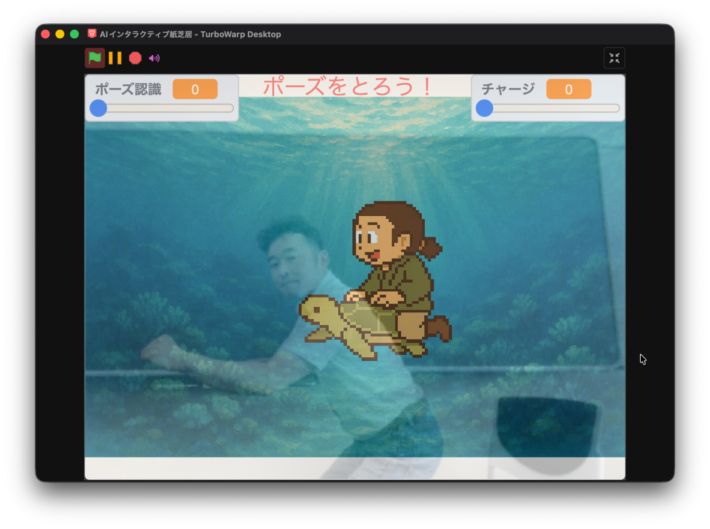

# **AIを使って「紙芝居の物語に参加する仕組み」を作ろう！** 「親子AIプログラミング体験会」@千葉商科大学 (2026/08/01)

千葉商科大学 総合政策学部 教授 久保裕也

2026/07/21 更新

{style="width: 601.70px;"}

この教材はCreative Commons CC-BY-SA 4.0で利用可能です。

{style="width: 129.00px;"}

<nav class="cover-navigation" aria-label="文書ナビゲーション"><a href="toc.html">目次へ</a><a href="../../">ドキュメント一覧へ</a><a href="https://vivliostyle.org/viewer/#src=https://kubohiroya.github.io/tmpose-kamishibai/docs/workshops/2026-08-01/publication.json&amp;bookMode=true" target="_blank" rel="noopener">Vivliostyle Viewerで読む（目次パネル）</a></nav>
